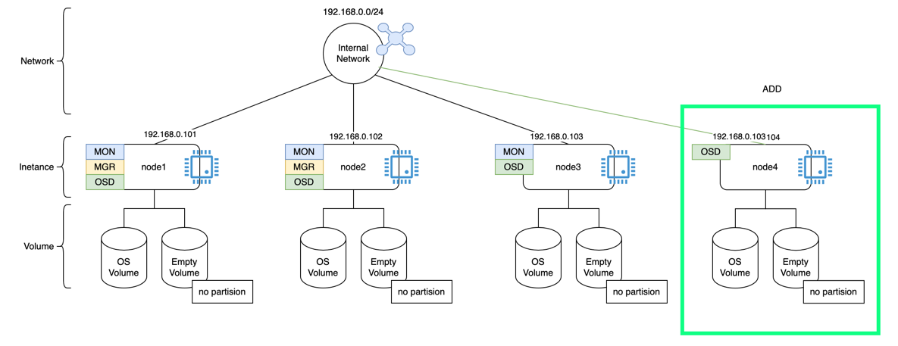

# OSD 확장
기존 ceph 클러스터에 신규 node를 추가하여 OSD를 확장하는 샘플



## 기존 상태
```shell
# 클러스터 상태 확인
ceph status

# >>>>
#  cluster:
#    id:     28b4d8fa-e67b-11f0-b603-42010a8a0004
#    health: HEALTH_OK
# 
#  services:
#    mon: 3 daemons, quorum ceph-node-1,node2,node3 (age 25m)
#    mgr: node1.aumjwv(active, since 25m), standbys: node2.ugeukv
#    osd: 3 osds: 3 up (since 25m), 3 in (since 2d)
# 
#  data:
#    pools:   2 pools, 33 pgs
#    objects: 26 objects, 16 MiB
#    usage:   114 MiB used, 60 GiB / 60 GiB avail
#    pgs:     33 active+clean

# 용량 확인
ceph df

# >>>>
#    --- RAW STORAGE ---
#    CLASS    SIZE   AVAIL     USED  RAW USED  %RAW USED
#    ssd    60 GiB  60 GiB  114 MiB   114 MiB       0.18
#    TOTAL  60 GiB  60 GiB  114 MiB   114 MiB       0.18
#     
#    --- POOLS ---
#    POOL     ID  PGS   STORED  OBJECTS     USED  %USED  MAX AVAIL
#    .mgr      1    1  577 KiB        2  1.7 MiB      0     19 GiB
#    rbdpool   2   32  4.3 MiB       24   13 MiB   0.02     19 GiB
```


## 노드 추가
### 사전 준비
```shell
# host 설정
hostnamectl set-hostname node4

# 필수 패키지 설치 (node1 ~ node3 과 동일하게)
dnf update -y
dnf install -y chrony lvm2 podman curl
systemctl enable --now chronyd
```

### hosts 설정 (기존 node 들도 모두 신규 노드 추가 권장)
```shell
cat <<EOF >> /etc/hosts
192.168.0.101 node1
192.168.0.102 node2
192.168.0.103 node3
192.168.0.104 node4
EOF
```

### ssh 설정 
> node4에서 진행
```shell
# /etc/ssh/sshd_config에서 아래 설정으로 되어있는지 확인
# PermitRootLogin yes
# PubkeyAuthentication yes
# PasswordAuthentication yes
vi /etc/ssh/sshd_config

# 변경하였다면 sshd 재시작
systemctl restart sshd

```

### ssh 접근 설정 
> node1에서 진행
```shell
# ceph cephadm get-pub-key > /root/.ssh/ceph_key.pub
ssh-copy-id -f -i /root/.ssh/ceph_key.pub root@node4
```

## node4를 클러스터에 추가 
> node1에서 진행
```shell
ceph orch host add node4 192.168.0.104

# 확인
ceph orch host ls

# >>>>
#    HOST         ADDR           LABELS  STATUS  
#    node1        192.168.0.101  _admin          
#    node2        192.168.0.102                  
#    node3        192.168.0.103                  
#    node4        192.168.0.104                  
#    4 hosts in cluster
```

## 신규 OSD 확장
```shell

# 빈 볼륨 추가
ceph orch apply osd --all-available-devices

# 특정 볼륨 명시가 필요할 경우 아래 명령처럼 사용
# ceph orch daemon add osd node4:/dev/sdb


# 클러스터 확인
ceph status
# >>>>
#  cluster:
#    id:     28b4d8fa-e67b-11f0-b603-42010a8a0004
#    health: HEALTH_OK
# 
#  services:
#    mon: 3 daemons, quorum ceph-node-1,node2,node3 (age 45m)
#    mgr: ceph-node-1.aumjwv(active, since 45m), standbys: node2.ugeukv
#    osd: 4 osds: 4 up (since 3m), 4 in (since 3m)
# 
#  data:
#    pools:   2 pools, 33 pgs
#    objects: 26 objects, 16 MiB
#    usage:   146 MiB used, 80 GiB / 80 GiB avail
#    pgs:     33 active+clean

# 용량 확인
ceph df
# >>>>
#    --- RAW STORAGE ---
#    CLASS    SIZE   AVAIL     USED  RAW USED  %RAW USED
#    ssd    80 GiB  80 GiB  146 MiB   146 MiB       0.18
#    TOTAL  80 GiB  80 GiB  146 MiB   146 MiB       0.18
#     
#    --- POOLS ---
#    POOL     ID  PGS   STORED  OBJECTS     USED  %USED  MAX AVAIL
#    .mgr      1    1  577 KiB        2  1.7 MiB      0     25 GiB
#    rbdpool   2   32  4.3 MiB       24   13 MiB   0.02     25 GiB
```