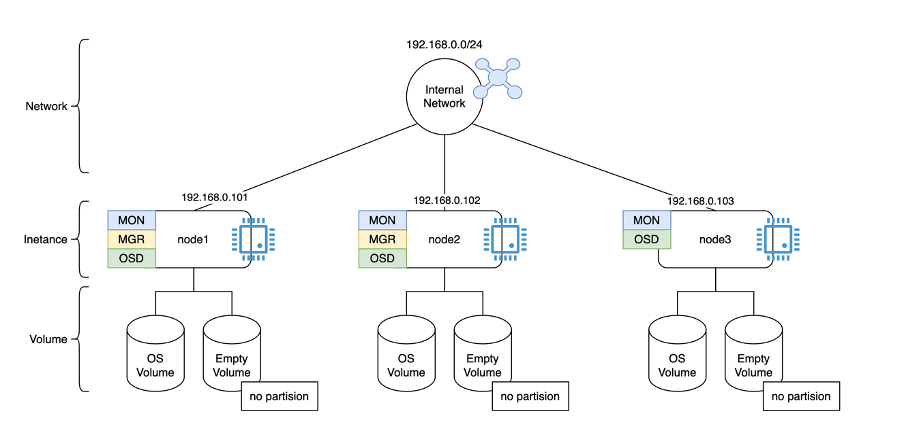

# ceph 클러스터 구성
3개의 vm위에 ceph를 목표 구성에 맞는 ceph를 설치

## 목표
3대의 VM에 ceph 클러스터 구성
### 목표 아키텍처

```
node1 (rocky9)
 ├─ MON
 ├─ MGR (active)
 └─ OSD x1+

node2 (rocky9)
 ├─ MON
 ├─ MGR (standby)
 └─ OSD x1+

node3 (rocky9)
 ├─ MON
 └─ OSD x1+
```

## 설치 과정
3대의 VM에 ceph 클러스터 구성을 위한 설치 과정
### 호스트 네임 설정 (각 노드에서 설정)
```shell
# node 1 콘솔
hostnamectl set-hostname node1
# node 2 콘솔
hostnamectl set-hostname node2
# node 3 콘솔
hostnamectl set-hostname node3
```

### hosts 설정 (모든 노드 동일)
```shell
cat <<EOF >> /etc/hosts
192.168.0.101 node1
192.168.0.102 node2
192.168.0.103 node3
EOF
```

### 필수 패키지 설치
```shell
dnf update -y
dnf install -y chrony lvm2 podman curl
systemctl enable --now chronyd
```

### cephadm 설치 (노드1만 진행)
```shell
# cephadm 다운로드
curl --silent --remote-name https://download.ceph.com/rpm-reef/el9/noarch/cephadm
chmod +x cephadm
mv cephadm /usr/local/bin/

# 패키지 repo 추가
cephadm add-repo --release reef
cephadm install
```

### Bootstrap (클러스터 생성)
```shell
# root로 진행 시 /etc/ssh/sshd_config에서 아래 설정으로 되어있는지 확인
# PermitRootLogin yes
# PubkeyAuthentication yes
# PasswordAuthentication yes

cephadm bootstrap \
  --mon-ip 192.168.0.101 \
  --cluster-network 192.168.0.0/24 \
  --initial-dashboard-user admin \
  --initial-dashboard-password admin123
```
> 명령 실행 결과
> - MON 1개 생성
> - MGR 생성
> - ceph.conf / keyring 자동 구성
> - Ceph Dashboard 활성화

### cephadm shell 진입
> 앞으로 클러스터 구성(ceph 명령 사용 시) 아래 방법으로 cephadm shell을 사용
```shell
cephadm shell
# 진입 후 확인
ceph status
# 나가기
exit
```

### 나머지 노드 추가 (cephadm shell에서 수행)
```shell
# key 배포
ceph cephadm get-pub-key > /root/.ssh/ceph_key.pub
ssh-copy-id -f -i /root/.ssh/ceph_key.pub root@node2
ssh-copy-id -f -i /root/.ssh/ceph_key.pub root@node3

# 호스트 추가
ceph orch host add node2 192.168.0.102
ceph orch host add node3 192.168.0.103

# 확인
ceph orch host ls
```

### MON / MGR 확장
```shell
# MON 3개로 확장
ceph orch apply mon --placement="3"

# MGR 2개로 확장
ceph orch apply mgr --placement="2"

# 확인
ceph quorum_status
ceph mgr stat

```

### OSD 추가
#### 사전 준비
> OSD 추가 전 각 node(인스턴스)에는 OS 볼륨을 제외한 빈 볼륨이 추가된 상태이어야 한다.
```shell
# 빈 볼륨 확인
lsblk
NAME   MAJ:MIN RM  SIZE RO TYPE MOUNTPOINTS
sda      8:0    0   20G  0 disk 
├─sda1   8:1    0  200M  0 part /boot/efi
└─sda2   8:2    0 19.8G  0 part /
sdb      8:16   0   20G  0 disk # 빈 볼륨
```

#### 추가
```shell
# 명시적으로 추가 시
ceph orch daemon add osd node1:/dev/sdb

# 자동 추가 시 (이용 가능한 볼륨을 자동으로 추가)
ceph orch apply osd --all-available-devices

# 확인
ceph osd tree
ceph osd status
>>>
ID  HOST          USED  AVAIL  WR OPS  WR DATA  RD OPS  RD DATA  STATE      
 0  node1        27.6M  19.9G      0        0       0        0   exists,up  
 1  node3        27.6M  19.9G      0        0       0        0   exists,up  
 2  node2        27.6M  19.9G      0        0       0        0   exists,up 
```

## 설치 확인
```shell
ceph status
>>>
  cluster:
    id:     28b4d8fa-e67b-11f0-b603-42010a8a0004
    health: HEALTH_OK
 
  services:
    mon: 3 daemons, quorum ceph-node-1,node2,node3 (age 3m)
    mgr: node1.aumjwv(active, since 106m), standbys: node2.ugeukv
    osd: 3 osds: 3 up (since 2m), 3 in (since 2m)
 
  data:
    pools:   1 pools, 1 pgs
    objects: 2 objects, 577 KiB
    usage:   83 MiB used, 60 GiB / 60 GiB avail
    pgs:     1 active+clean
    
ceph health detail
>>>
HEALTH_OK # 정상 시 출력


```