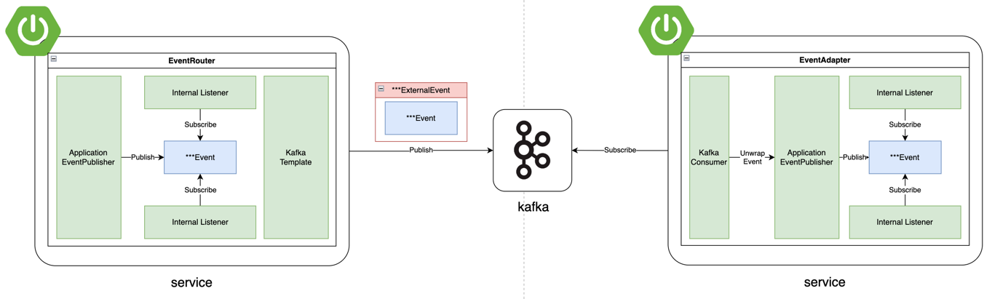
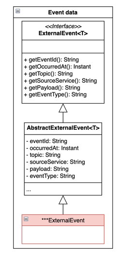
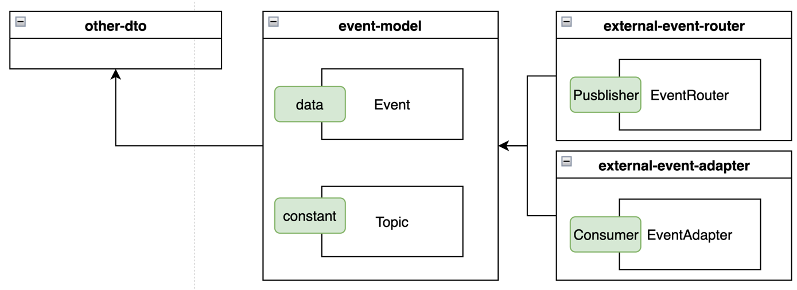
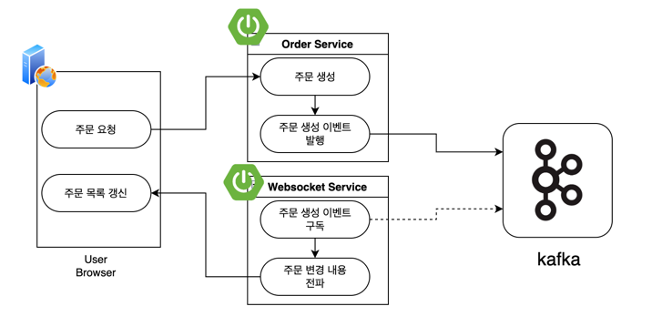
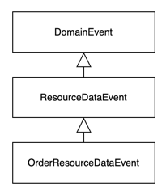

# 프로젝트 개요
Spring Cloud 구성을 통해 MSA 구조 핸즈온 프로젝트

# 프로젝트 구조
```shell
.
├── app
    ├── api-gateway-app # API Gateway
    ├── auth-service-app # Service (인증)
    ├── eureka-server-app # Discovery
    ├── order-service-app # Service (주문)
    ├── payment-service-app # Service (결제)
    ├── settings.gradle
└── src
    ├── main
    └── test
.
└── hands-on-msa-with-spring-cloud
    ├── README.md
    ├── app # 애플리케이션
    │   ├── api-gateway-app # API Gateway
    │   ├── auth-app  # Service (인증)
    │   ├── eureka-server-app # Discovery
    │   ├── order-service-app # Service (주문)
    │   ├── payment-service-app # Service (결제)
    │   ├── product-service-app # Service (상품)
    │   ├── ui-app # UI
    │   └── websocket-service-app # Service (웹소켓)
    ├── data # 데이터
    │   ├── auth-service-dto # 데이터 (인증)
    │   ├── event-model # 이벤트
    │   ├── order-service-dto # 데이터 (주문)
    │   └── product-service-dto # 데이터 (상품)
    ├── lib # 라이브러리 
    │   ├── auth-service-client # 인증 API 클라이언트
    │   ├── external-event-adapter # 공통 외부 이벤트 리스너
    │   ├── external-event-router # 공통 외부 이벤트 퍼블리셔
    │   ├── internal-service-client # 내부 API Rest client
    │   ├── rest-model # 내부 Rest 데이터 및 예외 처리
    │   ├── security-filter # 인증 공통 필터
    │   ├── security-util # 인증 공통 유틸 
    ├── readme # README 작성용
    │   ├── ...

```

# 아키텍처


| 서비스 이름                                       | port | 역할            |
|----------------------------------------------|------|---------------|
| **Spring Cloud Gateway** (`api-gateway`)     | 8080 | 클라이언트 요청을 라우팅 |
| **Spring Cloud Eureka** (`eureka-server`)    | 8761 | 서비스 등록 및 검색   |
| **Auth Service** (`auth-service`)            | 8888 | 인증 관련 서비스     |
| **Order Service** (`order-service`)          | 8081 | 주문 관련 서비스     |
| **Payment Service** (`payment-service`)      | 8082 | 결제 관련 서비스     |
| **Websocket Service** (`webesocket-service`) | 8083 | 웹소켓 관련 서비스    |
| **Product Service** (`products-service`)     | 8084 | 상품 관련 서비스     |

## 흐름
1. 모든 마이크로서비스는 Eureka에 등록
2. API Gateway가 Eureka를 통해 동적으로 마이크로서비스 찾기
3. 클라이언트는 API Gateway를 통해 Order Service 또는 Payment Service 호출
4. API Gateway는 클라이언트 Request의 인증값(session)을 인증 서버를 통해 검증
5. 인증이 검증되면 Service에 요청 라우팅


# 구성 방법
각 서비스별 구성 방법
### [Spring Cloud Gateway](app/api-gateway-app/README.md)

### [Spring Cloud Eureka](app/eureka-server-app/README.md)

### [Auth Service](app/auth-app/README.md)

### [Order Service](app/order-service-app/README.md)

### [Payment Service](app/payment-service-app/README.md)

### [Websocket Service](app/websocket-service-app/README.md)

### [Product Service](app/product-service-app/README.md)

# 인증 과정
인증값은 크게 3가지를 사용함
- Next token : Authjs5에서 사용하는 인증 토큰 (프론트 UI에서 사용)
- Session : Spring Security의 Session으로 사용자와 Gateway 사이에서 사용
- Passport : JWT 형태로 각 서비스 간 요청의 인증에 사용

## Browser -> Nextjs 인증 흐름
인증 후 발급된 Authjs의 Token을 클라이언트가 요청 시 함께 전달함 <br/>
전달된 Token을 Next서버가 가로채어 Token에서 Session 정보를 추출한 뒤 Request Cookie에 추가하여 요청을 라우팅함


## Gateway -> Service 인증 흐름
Gateway는 사용자의 session을 받아 인증 서비스로부터 Passport를 생성하고, Passport를 통해 서비스간 인증을 수행


# 이벤트 구조
공통 이벤트를 처리하는 구조

## 이벤트 처리 구조
이벤트는 내부 이벤트와 외부 이벤트로 나뉘며, event-router와 event-adaptor를 통해 내부 이벤트를 서로 다른 서비스들이 공유할 수 있는 구조를 가짐

### 이벤트 발행 과정
1. EventRouter에 발생시킬 이벤트를 전달
2. EventRouter는 전달받은 이벤트를 내부 이벤트로 발행
3. 이후 이벤트를 JSON으로 직렬화 한 뒤 ExternalEvent로 랩핑
4. 랩핑된 ExternalEvent를 Kafka에 `전역 이벤트 토픽`으로 발행

### 이벤트 구독 과정
1. EventAdaptor는 Kafka로부터 `전역 이벤트 토픽`을 구독
2. `전역 이벤트 토픽`으로부터 ExternalEvent 이벤트를 가져옴
3. ExternalEvent 이벤트 내부에 있는 payload를 역직렬화
4. 역직렬화된 이벤트 정보룰 내부 이벤트로 발행

## 외부 이벤트 데이터 구조

- eventId: 이벤트의 고유한 ID
- occurredAt : 발생 시점
- topic : 발행할 토픽
- sourceService : 발행한 서비스 (해당 서비스가 구독하여 중복 전파하는 것을 방지)
- payload : 직렬화된 내부 이벤트 정보
- eventType : 직렬화 전 클래스 타입 정보 (원래의 클래스로 역직렬화 하기위해 사용)

## 이벤트 처리를 위한 요소

 - event-model : 공통 이벤트 정의
 - event-router : 이벤트 발행 공통 컴포넌트
 - event-adaptor : 이벤트 구독 공통 컴포넌트

## 활용 예시
공통 이벤트 처리 구조를 활용하여 주문 목록을 실시간으로 갱신하는 예시

1. 사용자는 상품 페이지에서 상품을 `주문`
2. 주문 서비스는 주문 요청을 받고 `주문을 생성`
3. 주문 생성 후 주문 생성 `이벤트 발행`
4. 웹소켓 서비스는 주문 생성 `이벤트를 구독`
5. 주문 생성 이벤트가 발생하면 주문 변경 내용을 사용자 `브라우저에 전파` (ws이용)
6. 사용자 브러우저에서 `주문 목록을 갱신`하여 최신 데이터 유지
### 주문 생성 관련 이벤트

```java
//외부 이벤트에서 내부 이벤트를ㄹ 랩핑할 때 활용함
@Getter
@NoArgsConstructor
public class DomainEvent {
}

//정보 변경 시 발행되는 이벤트
@Getter
@NoArgsConstructor
public class ResourceDataEvent<T> extends DomainEvent{
    private T data;
    private EventType eventType;

    public ResourceDataEvent(T data, EventType eventType) {
        this.data = data;
        this.eventType = eventType;
    }
}

//주문 정보 변경 시 발행되는 이벤트
@Getter
@NoArgsConstructor
public class OrderResourceDataEvent extends ResourceDataEvent<OrderDto> {

    public OrderResourceDataEvent(OrderDto data, EventType eventType) {
        super(data, eventType);
    }
}

```


# 테스트
## 로그인
계정에 로그인하여 session을 cookie에 받아옴
```shell
curl -c cookies.txt -X POST http://localhost:8080/auth/login   -d "username=user1&password=password1"
```

## API 호출
```shell
curl --location --request POST 'http://localhost:8081/orders' \
--header 'X-Passport-Token: ...' \
--header 'Content-Type: application/json' \
--data-raw '{
    "productId": 1,
    "amount": 1
}'
# >> {
# >>    "id": 1,
# >>    "productId": 1,
# >>    "amount": 1,
# >>    "totalPrice": 1000,
# >>    "createdAt": "2025-08-18T00:02:35.853616",
# >>    "updatedAt": "2025-08-18T00:02:35.853655"
# >>}
```