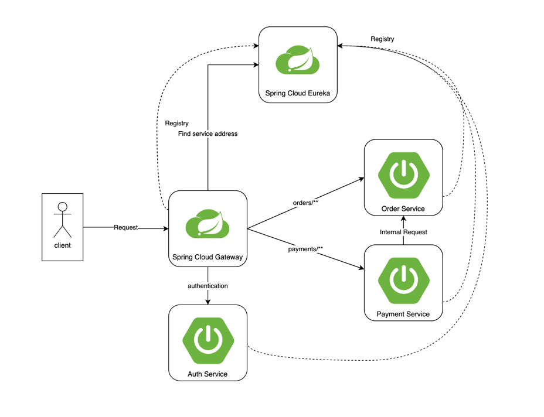

# 프로젝트 개요
Spring Cloud 구성을 통해 MSA 구조 핸즈온 프로젝트

# 프로젝트 구조
```shell
.
├── ...
├── api-gateway-app # API Gateway
├── eureka-server-app # Discovery
├── order-service-app # Service (주문)
├── payment-service-app # Service (결제)
├── settings.gradle
└── src
    ├── main
    └── test
```

# 아키텍처


✔ **Spring Cloud Gateway** (`api-gateway`) → 클라이언트 요청을 라우팅

✔ **Spring Cloud Eureka** (`eureka-server`) → 서비스 등록 및 검색

✔ **Order Service** (`order-service`) → 주문 관련 서비스

✔ **Payment Service** (`payment-service`) → 결제 관련 서비스

## 흐름
1. 모든 마이크로서비스는 Eureka에 등록
2. API Gateway가 Eureka를 통해 동적으로 마이크로서비스 찾기
3. 클라이언트는 API Gateway를 통해 Order Service 또는 Payment Service 호출
4. Order Service가 내부적으로 Payment Service를 호출하여 결제 처리

# 설정
## Spring Cloud Gateway
### application.yml
```yaml
server:
  port: 8080

spring:
  application:
    name: api-gateway

  cloud:
    gateway:
      discovery:
        locator:
          enabled: true  # Eureka에서 서비스 자동 검색 (Eureka에 등록된 서비스로 자동 라우팅 활성화)
      routes:
        - id: order-service
          uri: lb://ORDER-SERVICE
          predicates:
            - Path=/orders/**

        - id: payment-service
          uri: lb://PAYMENT-SERVICE
          predicates:
            - Path=/payments/**

eureka:
  client:
    service-url:
      defaultZone: http://localhost:8761/eureka/

```

### Main Class (`ApiGatewayApplication.java`)
```java
@SpringBootApplication
@EnableDiscoveryClient
public class ApiGatewayApplication {
    public static void main(String[] args) {
        SpringApplication.run(ApiGatewayApplication.class, args);
    }
}

```

### buid.gradle
```groovy

ext {
	set('springCloudVersion', "2024.0.0")
}

dependencies {
	implementation 'org.springframework.cloud:spring-cloud-starter-gateway'
	implementation 'org.springframework.cloud:spring-cloud-starter-netflix-eureka-client'

	...
}

dependencyManagement {
	imports {
		mavenBom "org.springframework.cloud:spring-cloud-dependencies:${springCloudVersion}"
	}
}

```
**API Gateway가 Eureka를 통해 마이크로서비스의 위치를 자동으로 감지**

## Spring Cloud Eureka
### application.yml
```yaml
server:
  port: 8761

spring:
  application:
    name: eureka-server

eureka:
  client:
    register-with-eureka: false
    fetch-registry: false

```

### Main Class (`EurekaServerApplication.java`)

```java
@SpringBootApplication
@EnableEurekaServer
public class EurekaServerApplication {
    public static void main(String[] args) {
        SpringApplication.run(EurekaServerApplication.class, args);
    }
}

```

### buid.gradle

```groovy
ext {
	set('springCloudVersion', "2024.0.0")
}

dependencies {
	implementation 'org.springframework.cloud:spring-cloud-starter-netflix-eureka-server'
}

dependencyManagement {
	imports {
		mavenBom "org.springframework.cloud:spring-cloud-dependencies:${springCloudVersion}"
	}
}
```
**Eureka Server는 마이크로서비스들의 레지스트리 역할 수행.**

## Order Service
### application.yml

```yaml
server:
  port: 8081

spring:
  application:
    name: order-service

eureka:
  client:
    service-url:
      defaultZone: http://localhost:8761/eureka/

```

### Main Class (`OrderServiceApplication.java`)

```java
@Configuration
public class RestTemplateConfig {
    @Bean
    @LoadBalanced  // Eureka를 통해 서비스 검색
    public RestTemplate restTemplate() {
        return new RestTemplate();
    }
}

@SpringBootApplication
@EnableDiscoveryClient
@RestController
@RequestMapping("/orders")
@RequiredArgsConstructor
public class OrderServiceAppApplication {
    private final RestTemplate restTemplate;

    public static void main(String[] args) {
        SpringApplication.run(OrderServiceAppApplication.class, args);
    }
    
    @GetMapping("/{orderId}")
    public String getOrder(@PathVariable String orderId) {
        //LoadBalanced restTemplate으로 인해 PAYMENT-SERVICE 서비스 address 조회 가능
        String paymentResponse = restTemplate.getForObject("http://PAYMENT-SERVICE/payments/" + orderId, String.class);
        return "Order ID: " + orderId + ", Payment: " + paymentResponse;
    }
}


```

### build.graddle
```groovy
ext {
	set('springCloudVersion', "2024.0.0")
}

dependencies {
  implementation 'org.springframework.cloud:spring-cloud-starter-netflix-eureka-client'
	...
}

dependencyManagement {
	imports {
		mavenBom "org.springframework.cloud:spring-cloud-dependencies:${springCloudVersion}"
	}
}
```

**Order Service가 Payment Service를 호출할 때 Eureka에서 동적으로 위치를 찾음.**

## Payment Service
### application.yml

```yaml
server:
  port: 8082

spring:
  application:
    name: payment-service

eureka:
  client:
    service-url:
      defaultZone: http://localhost:8761/eureka/

```

### Main Class (`PaymentServiceApplication.java`)

```java
@SpringBootApplication
@EnableDiscoveryClient
@RestController
@RequestMapping("/payments")
public class PaymentServiceApplication {

    public static void main(String[] args) {
        SpringApplication.run(PaymentServiceApplication.class, args);
    }

    @GetMapping("/{orderId}")
    public String processPayment(@PathVariable String orderId) {
        return "Payment processed for Order ID: " + orderId;
    }
}

```

### gradle.build
```groovy
ext {
	set('springCloudVersion', "2024.0.0")
}

dependencies {
  implementation 'org.springframework.cloud:spring-cloud-starter-netflix-eureka-client'
	...
}

dependencyManagement {
	imports {
		mavenBom "org.springframework.cloud:spring-cloud-dependencies:${springCloudVersion}"
	}
}
```
**Payment Service는 Order Service에서 요청을 받을 수 있도록 `/payments/{orderId}` 엔드포인트를 제공.**

# 테스트
## API 호출
```shell
$ curl http://localhost:8080/orders/123
"Order ID: 123, Payment: Payment processed for Order ID: 123"
```