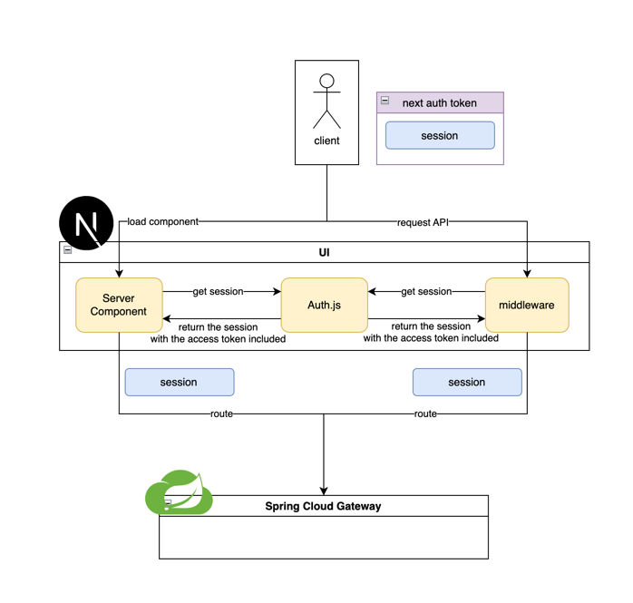
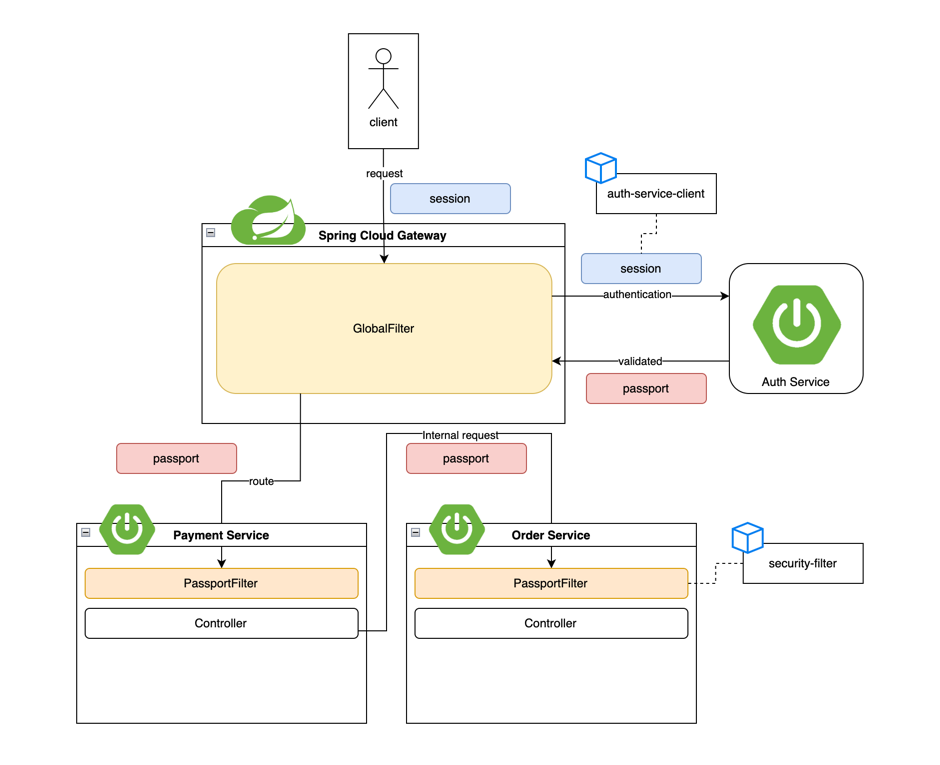

# 프로젝트 개요
Spring Cloud 구성을 통해 MSA 구조 핸즈온 프로젝트

# 프로젝트 구조
```shell
.
├── ...
├── api-gateway-app # API Gateway
├── auth-service-app # Service (인증)
├── eureka-server-app # Discovery
├── order-service-app # Service (주문)
├── payment-service-app # Service (결제)
├── settings.gradle
└── src
    ├── main
    └── test
```

# 아키텍처


| 서비스 이름                                       | port | 역할            |
|----------------------------------------------|------|---------------|
| **Spring Cloud Gateway** (`api-gateway`)     | 8080 | 클라이언트 요청을 라우팅 |
| **Spring Cloud Eureka** (`eureka-server`)    | 8761 | 서비스 등록 및 검색   |
| **Auth Service** (`auth-service`)            | 8888 | 인증 관련 서비스     |
| **Order Service** (`order-service`)          | 8081 | 주문 관련 서비스     |
| **Payment Service** (`payment-service`)      | 8082 | 결제 관련 서비스     |
| **Websocket Service** (`webesocket-service`) | 8083 | 웹소켓 관련 서비스    |

## 흐름
1. 모든 마이크로서비스는 Eureka에 등록
2. API Gateway가 Eureka를 통해 동적으로 마이크로서비스 찾기
3. 클라이언트는 API Gateway를 통해 Order Service 또는 Payment Service 호출
4. API Gateway는 클라이언트 Request의 인증값(session)을 인증 서버를 통해 검증
5. 인증이 검증되면 Service에 요청 라우팅


# 구성 방법
각 서비스별 구성 방법
### [Spring Cloud Gateway](app/api-gateway-app/README.md)

### [Spring Cloud Eureka](app/eureka-server-app/README.md)

### [Auth Service](app/auth-app/README.md)

### [Order Service](app/order-service-app/README.md)

### [Payment Service](app/payment-service-app/README.md)

### [Websocket Service](app/websocket-service-app/README.md)

# 인증 과정
인증값은 크게 3가지를 사용함
- Next token : Authjs5에서 사용하는 인증 토큰 (프론트 UI에서 사용)
- Session : Spring Security의 Session으로 사용자와 Gateway 사이에서 사용
- Passport : JWT 형태로 각 서비스 간 요청의 인증에 사용

## Browser -> Nextjs 인증 흐름
인증 후 발급된 Authjs의 Token을 클라이언트가 요청 시 함께 전달함 <br/>
전달된 Token을 Next서버가 가로채어 Token에서 Session 정보를 추출한 뒤 Request Cookie에 추가하여 요청을 라우팅함


## Gateway -> Service 인증 흐름
Gateway는 사용자의 session을 받아 인증 서비스로부터 Passport를 생성하고, Passport를 통해 서비스간 인증을 수행


# 테스트
## 로그인
계정에 로그인하여 session을 cookie에 받아옴
```shell
curl -c cookies.txt -X POST http://localhost:8080/auth/login   -d "username=user1&password=password1"
```

## API 호출
```shell
curl -b cookies.txt http://localhost:8080/orders/123
# >> "Order ID: 123, Payment: Payment processed for Order ID: 123"
```