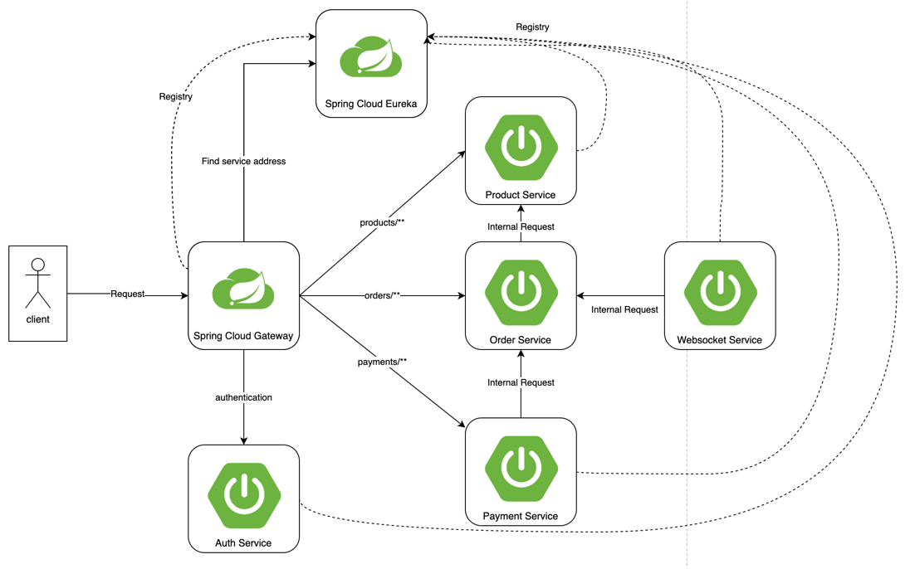

# 프로젝트 개요
Spring Cloud 구성을 통해 MSA 구조 핸즈온 프로젝트

# 프로젝트 구조
```shell
.
├── ...
├── api-gateway-app # API Gateway
├── auth-service-app # Service (인증)
├── eureka-server-app # Discovery
├── order-service-app # Service (주문)
├── payment-service-app # Service (결제)
├── settings.gradle
└── src
    ├── main
    └── test
```

# 아키텍처


| 서비스 이름                                    | port | 역할            |
|-------------------------------------------|------|---------------|
| **Spring Cloud Gateway** (`api-gateway`)  | 8080 | 클라이언트 요청을 라우팅 |
| **Spring Cloud Eureka** (`eureka-server`) | 8761 | 서비스 등록 및 검색   |
| **Auth Service** (`auth-service`)         | 8888 | 인증 관련 서비스     |
| **Order Service** (`order-service`)       | 8081 | 주문 관련 서비스     |
| **Payment Service** (`payment-service`)   | 8082 | 결제 관련 서비스     |

## 흐름
1. 모든 마이크로서비스는 Eureka에 등록
2. API Gateway가 Eureka를 통해 동적으로 마이크로서비스 찾기
3. 클라이언트는 API Gateway를 통해 Order Service 또는 Payment Service 호출
4. API Gateway는 클라이언트 Request의 인증값(session)을 인증 서버를 통해 검증
5. 인증이 검증되면 Service에 요청 라우팅


# 구성 방법
각 서비스별 구성 방법
### [Spring Cloud Gateway](api-gateway-app/README.md)

### [Spring Cloud Eureka](eureka-server-app/README.md)

### [Auth Service](auth-server-app/README.md)

### [Order Service](order-service-app/README.md)

### [Payment Service](payment-service-app/README.md)

# 테스트
## API 호출
```shell
$ curl http://localhost:8080/orders/123
"Order ID: 123, Payment: Payment processed for Order ID: 123"
```