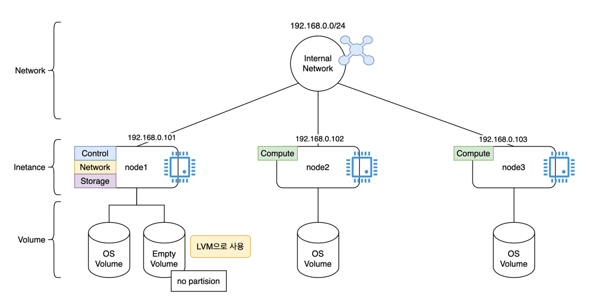

# Kolla ansible로 openstack 설치하기
Kolla ansible을 사용하여 openstack을 설치하는 방법을 정리

## 목표
3개의 VM위에 컨트롤 노드 1개, 컴퓨트 노드 2개로 구성된 Openstack을 설치

| 노드    | 역할                                | OS     |
|-------|-----------------------------------|--------|
| node1 | control + network + storage (LVM) | Rocky9 |
| node2 | compute                           | Rocky9 |
| node3 | compute                           | Rocky9 |


## 설치 과정
### 사전 준비
> 모든 노드
```shell
# swap off
swapoff -a
sed -i '/swap/d' /etc/fstab

# SELinux
setenforce 0
sed -i 's/^SELINUX=.*/SELINUX=permissive/' /etc/selinux/config

# docker 설치
dnf install -y yum-utils
dnf config-manager --add-repo https://download.docker.com/linux/centos/docker-ce.repo
dnf install -y docker-ce docker-ce-cli containerd.io
systemctl enable --now docker
```

### 호스트 네임 설정 
> 각 노드에서 설정
```shell
# node 1 콘솔
hostnamectl set-hostname node1
# node 2 콘솔
hostnamectl set-hostname node2
# node 3 콘솔
hostnamectl set-hostname node3
```

### hosts 설정
> 모든 노드 동일
```shell
cat <<EOF >> /etc/hosts
192.168.0.101 node1
192.168.0.102 node2
192.168.0.103 node3
EOF
```

### ssh 키 설정
> node1
```shell
ssh-keygen -t ed25519
ssh-copy-id root@node1
ssh-copy-id root@node2
ssh-copy-id root@node3
```

### ssh 키 접근 설정
> 모든 노드 동일
```shell
vi /etc/ssh/sshd_config
# /etc/ssh/sshd_config에서 아래 설정으로 되어있는지 확인
# PermitRootLogin yes
# PubkeyAuthentication yes
# PasswordAuthentication yes

# 변경 후 restart
systemctl restart sshd
```

### Kolla-ansible 설치
> node1
```shell
dnf install -y python3-pip python3-devel gcc libffi-devel openssl-devel git
pip3 install -U pip
pip3 install ansible kolla-ansible
# 아래 형상관리 링크 방문하여 브랜치 명 확인 후 업데이트
pip3 install --upgrade git+https://opendev.org/openstack/kolla-ansible@unmaintained/2024.1
kolla-ansible install-deps


# 확인
kolla-ansible --version
# kolla-ansible과 ansible의 버전을 서로 호환되는지 확인 필요
ansible --version
```

### Kolla 설정 파일 준비
```shell
mkdir -p /etc/kolla
cp -r /usr/local/share/kolla-ansible/etc_examples/kolla/* /etc/kolla

cp /usr/local/share/kolla-ansible/ansible/inventory/* /etc/kolla/
cd /etc/kolla
ll

# >>>
#    -rw-r--r--. 1 root root  7505 Jan  4 16:00 all-in-one
#    -rw-r--r--. 1 root root 33545 Jan  4 16:22 globals.yml
#    -rw-r--r--. 1 root root  8116 Jan  4 16:07 multinode

```

### Inventory 파일 작성
> node1
> 
> [multinode](ref/multinode)
```shell
vi multinode
# 하단 부분 수정
#    [control]
#    node1 ansible_host=192.168.0.101
#    
#    [network]
#    node1 ansible_host=192.168.0.101
#    
#    [compute]
#    node2 ansible_host=192.168.0.102
#    node3 ansible_host=192.168.0.103
#    
#    [monitoring]
#    node1
#    
#    [storage]
#    node1
```

### globals.yml 파일 작성
> node 1
> 
> [globals.yml](ref/globals.yml)
```shell
vi /etc/kolla/globals.yml
# 아래 내용으로 수정
#    kolla_base_distro: "rocky"
#    openstack_release: "2024.1"
#    # GCP VPC 특성으로 인해 로컬 ip 사용  (일반적으로 vip 활성화 시에는 vip 사용)
#    kolla_internal_vip_address: "192.168.0.101"
#    
#    내부 컴포넌트간 통신용 이더넷
#    network_interface: "eth1"
#    외부 통신용 이더넷
#    neutron_external_interface: "eth0"
#    
#    enable_neutron_provider_networks: "yes"
#    # GCP VPC 특성으로 인해 vip 미사용 (일반적으로 vip 활성화 시에는 사용)
#    enable_haproxy: "no"
#    enable_keystone: "yes"
#    enable_glance: "yes"
#    enable_nova: "yes"
#    enable_neutron: "yes"
#    enable_cinder: "yes"
#    enable_cinder_backend_lvm: "yes"
#    cinder_volume_group: "cinder-volumes"

```

### external 네트워크 구성

외부 네트워크의 이더넷은 활성화 상태에서 ip를 할당받지 않아야함
```shell
# eth1가 external 이더넷일 경우 예시 (모든 노드 진행)
nmcli con mod eth1 ipv4.method disabled ipv4.dns "" ipv4.addresses "" ipv4.gateway ""
nmcli con down eth1
nmcli con up eth1
```

### LVM 구성
> node1 (storage)
```shell
# lvm2 패키지 설치
dnf install -y lvm2

# 디스크 확인
lsblk 

pvcreate /dev/sdb
vgcreate cinder-volumes /dev/sdb

# 확인
vgs
lvs

```

### Ansible collection 설치
```shell
ansible-galaxy collection install openstack.kolla.baremetal

# 확인
ansible-galaxy collection list | grep openstack.kolla

```

### kolla 배포 준비
```shell
cd /etc/kolla

# 비밀번호 생성
kolla-genpwd

# 배포 준비
kolla-ansible -i multinode bootstrap-servers
# 검증
kolla-ansible -i multinode prechecks

```

### Openstack 배포
```shell
# 경로 확인
pwd
# >>>
# /etc/kolla

kolla-ansible -i multinode deploy
# 위 명령으로 인한 초기화 시 아래 명령으로 초기화 하고 통신확인 (kolla-ansible -i multinode bootstrap-servers)부터 다시 시도
# kolla-ansible -i multinode destroy --yes-i-really-really-mean-it

kolla-ansible post-deploy
```

### Openstack cli 환경 설정
```shell
# openstack cli 설치
pip install python-openstackclient

source /etc/kolla/admin-openrc.sh
openstack service list

openstack compute service list
```

### 프로바이더 네트워크 설정

```shell
# 네트워크 생성
openstack network create --external --project admin \
  --provider-network-type flat\
  --provider-physical-network physnet1 \
  extnet
  
# 서브넷
openstack subnet create --project admin \
  --network extnet \
  --gateway 192.168.2.1 \
  --subnet-range 192.168.2.0/24 \
  --dhcp --allocation-pool start=192.168.2.10,end=192.168.2.250 \
  extnet-provider-subnet01
```