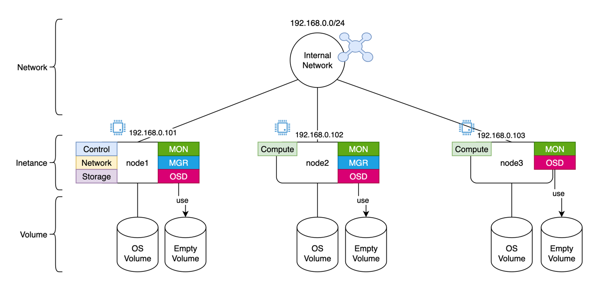

# kolla-ansible cinder (ceph 백엔드) 구성
kolla ansible로 cinder의 백엔드를 ceph로 구성하는 방법

## 사전준비
- ceph 클러스터
- Openstack 클러스터 (node1, node2, node3)



## Kolla-ansible Cinder 설치 설정

Cinder는 Volume으로 Ceph RBD를 사용할 수 있으며 kolla-ansible로 설치/배포 시 아래와 같이 설정할 수 있다.

### inventory 파일

```bash
[storage]
node1
```

### globals.yml

```bash
cinder_backend_ceph: "yes"
```

### ceph.conf 설정
> 처음 생성되는 conf에는 문자열 앞에 공백이 있으므로 공백을 지우고 사용
```bash
mkdir -p /etc/kolla/config/cinder
cp /etc/ceph/ceph.conf /etc/kolla/config/cinder
```

### pool 생성

```jsx
ceph osd pool create volumes 128
ceph osd pool application enable volumes rbd

ceph osd pool create backups 128
ceph osd pool application enable backups rbd

```

### keyring 설정

```bash
mkdir -p /etc/kolla/config/cinder/cinder-volume
mkdir -p /etc/kolla/config/cinder/cinder-backup

ceph auth caps client.cinder \
  mon 'allow r' \
  osd 'allow class-read object_prefix rbd_children, allow rwx pool=volumes, allow rwx pool=backups'
# cephadm shell로 사용 시 로컬 디스크 영역에서 출력값 붙여넣기
ceph auth get-or-create client.cinder > /etc/ceph/ceph.client.cinder.keyring

ceph auth caps client.cinder-backup \
  mon 'allow r' \
  osd 'allow class-read object_prefix rbd_children, allow rwx pool=volumes, allow rwx pool=backups'

# cephadm shell로 사용 시 로컬 디스크 영역에서 출력값 붙여넣기
ceph auth get-or-create client.cinder-backup > /etc/ceph/ceph.client.cinder-backup.keyring

# cephadm 사용 시 복제가 안될 수 있음
cp /etc/ceph/ceph.client.cinder.keyring /etc/kolla/config/cinder/cinder-volume/ceph.client.cinder.keyring
cp /etc/ceph/ceph.client.cinder.keyring /etc/kolla/config/cinder/cinder-backup/ceph.client.cinder.keyring
cp /etc/ceph/ceph.client.cinder-backup.keyring /etc/kolla/config/cinder/cinder-backup/ceph.client.cinder-backup.keyring
```

### nova에 ceph 설정

cinder volume에 접근하기 위해 nova 역시 설정이 필요함

#### ceph.conf 설정

```bash
mkdir /etc/kolla/config/nova
cp /etc/ceph/ceph.conf /etc/kolla/config/nova
```

### inventory 설정

```bash
[compute]
node2 ceph_cluster=ceph
node3 ceph_cluster=ceph
```

#### keyring 설정

```bash

ceph auth get-or-create client.nova \
  mon 'allow r' \
  osd 'allow class-read object_prefix rbd_children, allow rwx pool=volumes'

# cephadm shell로 사용 시 로컬 디스크 영역에서 출력값 붙여넣기
ceph auth get-or-create client.nova > /etc/ceph/ceph.client..keyring

mkdir -p /etc/kolla/config/nova/
cp /etc/ceph/ceph.client.cinder.keyring /etc/kolla/config/nova/ceph.client.cinder.keyring
```