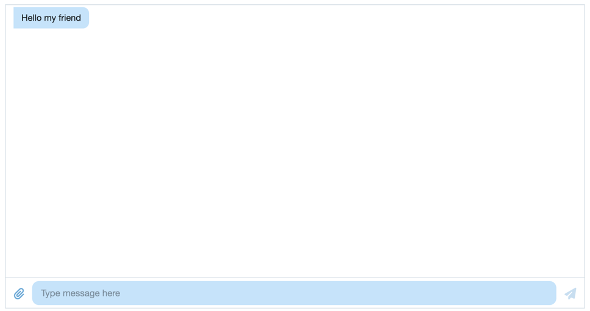

# chatscope@Chat UI Kit
Chat UI Kit은 웹 채팅 애플리케이션 개발을 위한 UI 툴킷이다.

# 설치
```shell
# Components
npm install @chatscope/chat-ui-kit-react
# Style
npm install @chatscope/chat-ui-kit-styles;
```

# 사용

## 기본 샘플
```tsx
import '@chatscope/chat-ui-kit-styles/dist/default/styles.min.css';
import { MainContainer, ChatContainer, MessageList, Message, MessageInput } from '@chatscope/chat-ui-kit-react';


const ChatScopeChatUiKitStandardSample = () => {
  return (
    <div style={{ position:"relative", height: "500px" }}>
      <MainContainer>
        <ChatContainer>
          <MessageList>
            <Message model={{
              position: "normal",
              direction: "incoming",
              message: "Hello my friend",
              sentTime: "just now",
              sender: "Joe"
            }} />
          </MessageList>
          <MessageInput placeholder="Type message here" />
        </ChatContainer>
      </MainContainer>
    </div>
  );
};

export default ChatScopeChatUiKitStandardSample;
```
