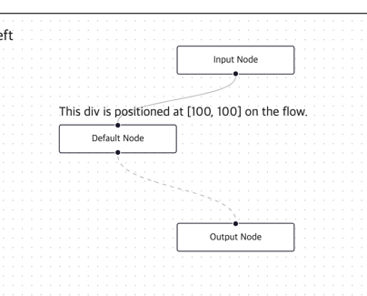

# react-flow
노드 기반의 에디터 혹은 인터렉티브한 다이어그램을 구현하기 위한 라이브러리

# 설치
```shell
npm install @xyflow/react
```

# 핵심 기능
- 쉬운 사용법 : React flow는 node 드래그, 줌 인/아웃, 뷰 이동(panning), 다중 노드, 엣지 선택, 엣지 추가/제거 등 다양한 기능을 제공
- 커스텀 : 노드 또는 엣지를 react component 형태로 커스텀 하는 기능을 제공
- 빠른 랜더링 : 변화가 있거나 뷰에 보이는 노드들만 랜더링
- 내장 플러그인: 
    > - `<Background />` : 커스터마이징 가능한 배경 패턴 구현 플러그인
    > - `<MiniMap />` : 코너에 미니맵 출력 플러그인
    > - `<Controls />` : 줌, 중앙, 락 제어 플러그인
    > - `<Panel />` : 콘텐츠를 뷰포트 위에 위치시키는 플러그인
    > - `<NodeToolbar />` : 노드에 붙여지는 툴바를 쉽게 만들어주는 플러그인
    > - `<NodeResizer />` : 노드에 리사이즈의 기능을 쉽게 만들어주는 플러그인
- 신뢰성 : React Flow는 전체적으로 타입스크립트로 작성되었고 E2E테스트를 진행하여 신뢰성을 유지함

# 용어


# 컨셉
- flow는 노드와 엣지로 구성.
- 노드와 엣지 배열을 ReactFlow 컴포넌트에 전달.
- 모든 노드와 엣지의 ID는 고유해야함.
- 노드는 위치와 라벨이 필요 (커스텀 노드는 다를 수 있음).
- 엣지는 소스 노드 ID와 타겟 노드 ID가 필요


# Controlled, Uncontrolled
React flow는 controlled 방식과 uncontrolled 방식 둘 다 지원
## Controlled
노드와 엣지의 상태를 React state로 관리하여 props를 통해 ReactFlow에 전달.

### 구현 샘플
- 상태 관리: 노드와 엣지를 상태로 관리 (useState 사용)
- ReactFlow에 전달: 상태값을 ReactFlow 컴포넌트의 nodes와 edges props로 전달
```tsx
const Controlled = () => {
  const [nodes, setNodes, onNodesChange] = useNodesState([...]);  // 노드 상태
  const [edges, setEdges, onEdgesChange] = useEdgesState([...]);  // 엣지 상태

  return (
    <ReactFlow
      nodes={nodes}
      edges={edges}
      onNodesChange={onNodesChange}
      onEdgesChange={onEdgesChange}
    />
  );
};
```

## Uncontrolled Flow (상태 미관리)
ReactFlow가 상태를 자동으로 관리하며, 노드와 엣지를 default 값으로 전달

### 구현 샘플
- 상태 관리하지 않음: nodes와 edges를 React Flow가 자동으로 관리.
- 노드 및 엣지 데이터 전달: 노드와 엣지를 단순히 초기값으로 전달
```tsx
const Uncontrolled = () => {
  const [nodes, setNodes] = useState([...]);
  const [edges, setEdges] = useState([...]);
  return (
    <ReactFlow
      defaultNodes={nodes}
      defaultEdges={edges}
    />
  );
};
```

# Layouting
서드파티 라이브러리들을 통해 node들을 레이아웃 해주는 기능을 지원
## Dagre
Dagre는 그래프 구조를 자동으로 레이아웃해주는 라이브러리, 
노드와 엣지 간의 관계를 기반으로 위치를 자동으로 계산
> 드와 엣지의 구조만 정의하면, 시각적으로 보기 좋은 배치를 Dagre가 자동으로 정해주는 방식
### 설치
```shell
npm i @dagrejs/dagre
```

### 사용법
> react flow에서 사용하는 방법은 `<ReactFlowLayoutingWithDagre/>` 컴포넌트 참고
```ts
//graph 객체 생성
const g = new Dagre.graphlib.Graph();
//graph 설정
g.setGraph({ rankdir: 'TB' });
/*
 * 기본 label 구조 지정
 * e.g. (g.setDefaultEdgeLabel(() => ({})) 라인 의미)
 * g.setEdge("a", "b"); // label 안 넣었지만
 * g.setEdge("a", "b", {}); // 빈 객체가 자동으로 들어감
 */
g.setDefaultEdgeLabel(() => ({}));
//node 정의
g.setNode("kspacey", { label: "Kevin Spacey", width: 144, height: 100 });
//edge 정의
g.setEdge("kspacey", "swilliams");
//레이아웃 실행
dagre.layout(g);
//결과
g.node(id) // { x, y, width, height, ... }
g.edge(source, target) // { points: [{x, y}, {x, y}, ...] }
```

### setGraph 옵션
| 속성명         | 기본값                 | 설명                                                                                        |
| ----------- | ------------------- | ----------------------------------------------------------------------------------------- |
| `rankdir`   | `'TB'`              | 계층 방향: `'TB'` (Top→Bottom), `'BT'` (Bottom→Top), `'LR'` (Left→Right), `'RL'` (Right→Left) |
| `align`     | `undefined`         | 같은 계층 내 노드 정렬 방향: `'UL'`, `'UR'`, `'DL'`, `'DR'`                                          |
| `nodesep`   | `50`                | 같은 계층 내 노드 간 수평 간격 (px)                                                                   |
| `edgesep`   | `10`                | 엣지 간 간격 (선들 사이의 거리, px)                                                                   |
| `ranksep`   | `50`                | 계층 간 수직 간격 (px). `rankdir`에 따라 좌우 간격이 되기도 함                                               |
| `marginx`   | `0`                 | 전체 그래프의 좌우 여백 (px)                                                                        |
| `marginy`   | `0`                 | 전체 그래프의 상하 여백 (px)                                                                        |
| `acyclicer` | `undefined`         | `'greedy'` 설정 시, 순환(edge cycle)을 제거하는 **탐욕적 알고리즘** 사용                                     |
| `ranker`    | `'network-simplex'` | 계층 결정 알고리즘:<br>– `'network-simplex'` (기본)<br>– `'tight-tree'`<br>– `'longest-path'`       |


### node 옵션
| 속성명      | 기본값 | 설명             |
| -------- | --- | -------------- |
| `width`  | `0` | 노드의 가로 크기 (px) |
| `height` | `0` | 노드의 세로 크기 (px) |


### edge 옵션
| 속성명           | 기본값   | 설명                                                 |
| ------------- | ----- | -------------------------------------------------- |
| `minlen`      | `1`   | 엣지의 최소 계층 수 (source와 target 사이의 거리 계층 수)           |
| `weight`      | `1`   | 엣지의 중요도. 값이 클수록 **직선화되고 짧아짐**                      |
| `width`       | `0`   | 엣지 라벨의 가로 크기 (px)                                  |
| `height`      | `0`   | 엣지 라벨의 세로 크기 (px)                                  |
| `labelpos`    | `'r'` | 라벨 위치: `'l'` = left, `'c'` = center, `'r'` = right |
| `labeloffset` | `10`  | 라벨과 엣지 간 거리 (labelpos가 `'l'` 또는 `'r'`일 때만 적용됨)     |

## d3-hierarchy
d3 hierarchy는 node가 1개 있을 때 root node로 하여 레이아웃해주는 라이브러리이다.
> root node가 1개가 아니거나, node의 width, height 사이즈가 서로 다른 경우 올바르게 동작되지 않을 수 있음
### 설치
```shell
npm i d3-hierarchy
npm i --save-dev @types/d3-hierarchy
```

### 사용법
> react flow 적용 샘플은 `<ReactFlowLayoutingD3Hierarchy/>` 컴포넌트 참고
```ts
// d3-hierarchy 트리 레이아웃 생성기
const g = tree<NodeData>();

// id/parentId 기반의 평탄한 배열을 계층 구조로 바꿈
const hierarchy = stratify<NodeData>()
        .id((node) => node.id) // 고유 ID 지정
        .parentId((node) =>
                edges.find((edge) => edge.target === node.id)?.source
        ); // 부모 노드 ID를 엣지 정보로부터 유추

// 계층 트리 생성 (노드 배열을 트리 구조로 변환)
const root = hierarchy(nodes as any);

// 트리 레이아웃 계산: 각 노드에 x, y 위치 자동 계산
const layout = g.nodeSize([width * 2, height * 2])(root as HierarchyNode<NodeData>);
```

## d3-force
물리 기반 라이브러리로서 각기 다른 힘을 노드에 적용하여 위치를 변경할 수 있다.

### 설치
```shell
npm i d3-force
npm i @types/d3-force
npm i d3-quadtree
npm i @types/d3-quadtree
```

### 사용법
> react flow 적용 샘플은 `<ReactFlowLayoutingWithD3Force/>` 컴포넌트 참고
```ts
/*
 * 시뮬레이션 엔진을 초기화하고 여러 개의 force를 등록할 수 있는 중앙 허브 역할.
 * 제네릭으로 Node + SimulationNodeDatum 확장한 타입을 넣어 node의 x, y, vx, vy, fx, fy 등을 추적.
 */
const simulation = forceSimulation<SimulationNodeDatum & Node>()
        .force('charge', forceManyBody().strength(-1000)) //forceManyBody() : 노드 간 반발력 (음수 = 밀어냄, 양수 = 끌어당김)
        .force('x', forceX().x(0).strength(0.05)) //forceX/Y() : X, Y축 기준으로 끌어당김 (그래프 중심 정렬용)
        .force('y', forceY().y(0).strength(0.05))
        .force('collide', collide())  //collide() : 사용자 정의 충돌 방지 force (quadtree 사용)
        .alphaTarget(0.05) //alphaTarget(0.05) : 시뮬레이션이 일정 수준의 에너지(움직임)를 유지
        .stop();  //stop() : 자동 시작 방지. tick()으로 수동 호출

/*
 * d3-quadtree를 이용해 효율적으로 충돌 감지
 * 각 노드의 반지름을 계산하고, 겹치는 경우 위치를 밀어내도록 조정
 * node.measured?.width 기반으로 노드의 크기를 고려한 충돌 반응 계산
 */
function collide() { ... }

//시뮬레이션 상태를 한 번 advance (한 프레임)
const tick = () => { ... }

//엣지를 force에 연결
simulation.nodes(nodes).force(
        'link',
        forceLink(edges)
                .id((d: any) => d.id)
                .strength(0.05) //강도
                .distance(100)  //간격
);

```

# Sub Flow
노드들을 구분하여 그룹핑할 수 있음
## 구현 샘플
노드들의 부모, 자식 관계를 만들어 구현할 수 있음 자식 노드들은 부모 노드의 우측 상단을 x:0, y:0의 위치로 계산되어 표현됨
### 노드
부모 자식 관계에서 자식 노드에 부모의 id를 담은 parentId 속성 설정 필요
> extent: 'parent' 속성을 추가하면 자식 노드가 부모 노드 밖으로 나오지 못 하게 함
> 부모 노드의 type: 'group'은 핸들 없는 노드를 생성하기 위해 사용되며 다른 type을 사용해도 무방

```ts
const initialNodes: Node[] = [
  {
    id: 'A',
    type: 'group',
    data: { label: null },
    position: { x: 0, y: 0 },
    style: {
      width: 170,
      height: 140,
    },
  },
  {
    id: 'B',
    type: 'input',
    data: { label: 'child node 1' },
    position: { x: 10, y: 10 },
    //부모 노드 지정
    parentId: 'A',
    //부모 노드 밖으로 나오지 못하게 함
    extent: 'parent',
  },
  {
    id: 'C',
    data: { label: 'child node 2' },
    position: { x: 10, y: 90 },
    parentId: 'A',
    extent: 'parent',
  },
];

```

# Components
Reat Flow에서 제공하는 컴포넌트


## `<Background/>`
다른 유형의 배경을 랜더링 하는 컴포넌트
### 사용법
```tsx
<ReactFlowBox>
  <ReactFlow
    ...
  >
    <Background
      id="1" //여러 Background가 존재할 경우 고유값으로 사용
      variant={BackgroundVariant.Dots} 
      gap={12} 
      size={1} 
    />
  </ReactFlow>
</ReactFlowBox>
```

## `<ControlButton />`
제어 패널에 버튼들을 추가는 컴포넌트
### 사용법
```tsx
<ReactFlow
  ...
>
  ...
  <Controls>
    <ControlButton onClick={() => alert('Something magical just happened. ✨')}>
      <AutoFixHighIcon /> {/*버튼 내용*/}
    </ControlButton>
  </Controls>
</ReactFlow>
```


## `<MiniMap />`
flow 위에 미니 맵을 출력
### 사용법
```tsx
<ReactFlow
  ...
>
  ...
  <MiniMap nodeStrokeWidth={3} />
</ReactFlow>
```

## `<Panel/>`
viewport위에 콘텐츠를 위치할때 사용되는 컴포넌트
### 사용법
```tsx
<ReactFlow
  ...
>
  /*좌측 상단에 내용 출력*/
  <Panel position="top-left">top-left</Panel>
</ReactFlow>
```


## `<ViewportPortal />`
노드 또는 엣지와 동일하게 viewport 위에 컴폰넌트를 올릴 때 사용되는 컴포넌트 (zoom-in, zoom-out 등 같이 영향을 받음)
```tsx
<ReactFlow
  ...
>
  ...
  <ViewportPortal>
    <div
            style={{ transform: 'translate(100px, 100px)', position: 'absolute' }}
    >
      This div is positioned at [100, 100] on the flow.
    </div>
  </ViewportPortal>
</ReactFlow>
```


## `<Handle />`
커스텀 노드에 연결지점을 정의하는 컴포넌트
### 사용법
```tsx
const CustomNode = (node : NodeProps<CustomNodeType>) => {
  return (
          <>
            ...
            <Handle type="target" position={Position.Left} />
            <Handle type="source" position={Position.Right} />
          </>
  );
};
```

## `<NodeResizeControl />`
노드 컴포넌트의 자식에 추가하면 크기 조절이 가능한 포인트를 생성해주는 컴포넌트

### 사용법
```tsx
const CustomNode = (node : NodeProps<CustomNodeType>) => {
  return (
          <div>
            ...
            <NodeResizeControl />
          </div>
  );
};
```


## `<NodeResizer />`
노드 컴포넌트의 자식에 추가하면 노드 주변의 모든 방향으로 크기 조절이 가능하도록 해주는 컴포넌트

### 사용법
```tsx
const CustomNode = (node : NodeProps<CustomNodeType>) => {
  return (
          <div>
            ...
            <NodeResizer minWidth={100} minHeight={30} />
          </div>
  );
};
```


## `<NodeToolbar />`
노드 주위에 툴팁이나 툴바를 랜더링하는 컴포넌트이며 viewport에 의해 크기조절 되지 않음

### 사용법
```tsx
const CustomNode = (node : NodeProps<CustomNodeType>) => {
  return (
          <div>
            <NodeToolbar isVisible position={Position.Top}>
              <button>delete</button>
              <button>copy</button>
              <button>expand</button>
            </NodeToolbar>
          </div>
  );
};
```


## `<EdgeLabelRenderer />`
Edge는 기본적으로 SVG로 랜더링되지만 해당 컴포넌트를 사용하여 div 베이스로 랜더링 할 수 있음

### 사용법
```tsx

const CustomEdge = (
        {
          id,
          data,
          ...props
        }: EdgeProps<CustomEdgeType>
) => {
  const [edgePath, labelX, labelY] = getBezierPath(props);

  return (
          <>
            <BaseEdge id={id} path={edgePath} />
            <EdgeLabelRenderer>
              <div
                      style={{
                        position: 'absolute',
                        transform: `translate(-50%, -50%) translate(${labelX}px,${labelY}px)`,
                        background: '#ffcc00',
                      }}
              >
                {data?.text}
              </div>
            </EdgeLabelRenderer>
          </>
  );
};
```


## `<EdgeText />`
커스텀 엣지 위에 텍스트를 출력하기 위한 헬퍼 컴포넌트
### 사용법
```tsx
const CustomEdge2 = (
        {
          id,
          data,
          ...props
        }: EdgeProps<CustomEdgeType>
) => {
  const [edgePath, labelX, labelY] = getBezierPath(props);

  return (
          <>
            <BaseEdge id={id} path={edgePath} />
            <EdgeText
                    x={labelX}
                    y={labelY}
                    label={data?.text}
                    labelStyle={{ fill: 'white' }}
                    labelShowBg
                    labelBgStyle={{ fill: 'red' }}
                    labelBgPadding={[2, 4]}
                    labelBgBorderRadius={2}
            />
          </>
  );
};
```


# Hooks
Reat Flow에서 제공하는 Hook

## `useConnection()`
현재 연결 상태를 반환하는 hook
### 사용법
```tsx
const ReactFlowHooks = () => {
  const connection = useConnection();
  return (
          <div>
            {connection ? `Someone is trying to make a connection from ${connection.fromNode?.id} to this one.` : 'There are currently no incoming connections!'}
          </div>
  );
};
```


## `useEdges()`
현재 엣지 배열들을 반환하는 hook

### 사용법
```tsx
const ReactFlowHooks = () => {
  const edgesFromHook = useEdges();

  return (
          <div>
            There are currently {edgesFromHook.length} edges!
          </div>
  );
};
```

## `useEdgesState()`, `useNodesState()`
노드와 엣지 상태를 컨트롤 방식으로 구현하기 쉽게 도와주는 hook

### 사용법
```tsx
const ReactFlowHooks = () => {
  const [nodes, setNodes, onNodesChange] = useNodesState(initialNodes);  // 노드 상태
  const [edges, setEdges, onEdgesChange] = useEdgesState(initialEdges);  // 엣지 상태
  
  return (
          <ReactFlow
                  nodes={nodes}
                  edges={edges}
                  onNodesChange={onNodesChange}
                  onEdgesChange={onEdgesChange}
          />
  );
};
```

## `useInternalNode()`
특정 노드의 내부 정보들을 반환

### 사용법
```tsx
const ReactFlowHooks = () => {
  const internalNode = useInternalNode('1');

  return (
          <div>
            {`node id : ${internalNode?.id} position x :${internalNode?.internals?.positionAbsolute.x} y : ${internalNode?.internals?.positionAbsolute.y}`}
          </div>
  );
};
```


## useKeyPress()
특정 키 코드 입력값을 감지하고 입력 여부를 반환

### 사용법
```tsx

const ReactFlowHooks = () => {
  ...
  const spacePressed = useKeyPress(
          //감지할 키
          'Space'
  );
  //키 조합의 경우 + 문자를 사용하여 작성할 수 있음
  const cmdAndSPressed = useKeyPress(['Meta+s', 'Strg+s']);

  return (
          <Stack direction="column" spacing={2}>
            <div>
              {spacePressed && <p>Space pressed!</p>}
              {cmdAndSPressed && <p>Cmd + S pressed!</p>}
            </div>
          </Stack>
  );
};
```

## useNodeConnections()
특정 노드와 핸들 정보로 연결 정보들을 반환

### 사용법
```tsx
const CustomNode = (node : NodeProps<CustomNodeType>) => {

  const connections = useNodeConnections({
    handleType: 'target',
  });

  return (
          <div style={{backgroundColor: 'white', width: '100%', height: '100%', border: '1px solid black'}}>
            <Handle type={"source"} position={Position.Top}/>
            <Handle type={"target"} position={Position.Left}/>
            <div>There are currently {connections.length} incoming connections!</div>
            <div>{node.data.label}</div>
          </div>
  );
};

```

## useNodeId()
노드의 ID를 가져올 때 사용됨 (노드 하위의 깊은 컴포넌트에서 drill down 없이 노드의 id를 가져올 때 활용)

### 사용법
```tsx

const CustomNode = (node : NodeProps<CustomNodeType>) => {

  const nodeId = useNodeId();

  return (
          <div style={{backgroundColor: 'white', width: '100%', height: '100%', border: '1px solid black'}}>
            ...
            <span>{nodeId}</span>
          </div>
  );
};

```

## useNodes()
노드들의 정보를 가져올 때 사용

### 사용법
```tsx
const ReactFlowHooks = () => {
  ...
  const nodesFromHook = useNodes();

  return (
          <Stack direction="column" spacing={2}>
            <div>There are currently {nodesFromHook.length} nodes!</div>
          </Stack>
  );
};
```

## useNodesData()
특정 노드의 data 정보를 가져올 때 사용

### 사용법
```tsx
const ReactFlowHooks = () => {
  const nodeData = useNodesData('4');

  return (
          <Stack direction="column" spacing={2}>
            <div>Type of node id 4 is {nodeData?.type}</div>
          </Stack>
  );
};
```

## useNodesInitialized()
flow의 모든 노드들이 랜더링(높이, 넓이 계산)된 상태 여부를 반환

### 사용법
```tsx
  const nodesInitialized = useNodesInitialized();
```

## useOnSelectionChange()
노드 또는 엣지에 변경 사항 발생을 listen함

### 사용법
```tsx
useOnSelectionChange({
  onChange: ({ nodes, edges }) => {
    console.log(`nodes changed to ${nodes.length} nodes`);
    console.log(`edges changed to ${edges.length} edges`);
  }
})
```

## useOnViewportChange()
viewport의 변경 사항 발생을 listen함

### 사용법
```tsx
useOnViewportChange({
  onStart: (viewport: Viewport) => console.log('start', viewport),
  onChange: (viewport: Viewport) => console.log('change', viewport),
  onEnd: (viewport: Viewport) => console.log('end', viewport),
});
```

##  useReactFlow()
reactFlow의 인스턴스 정보를 가져옴

### 사용법
```tsx
  const reactFlow = useReactFlow();
```

## useStore()
내부 상태를 사용할 때 사용됨 (Zustand로부터 재추출된 hook)

### 사용법
```tsx
  const nodes = useStore(state => state.nodes);
```

## useStoreApi()
store object를 반환하고 store에 직접 접근해야 할 때 사용

### 사용법
```tsx
const store = useStoreApi();
...
const { nodes } = store.getState();
```

## useUpdateNodeInternals()
내부 상태 변화를 react flow에 알려줄 때 사용됨

### 사용법
```tsx
const updateNodeInternals = useUpdateNodeInternals();
updateNodeInternals('node id');
```

## useViewport()
viewport 상태를 읽을 때 사용

### 사용법
```tsx
const { x, y, zoom } = useViewport();
```

# Utils
React Flow에서 제공하는 Util

## addEdge()
새로운 엣지를 연결하기 쉽게 도와주는 유틸

### 사용법
```tsx
const ReactFlowUtils = () => {
  const onConnect = useCallback(
          (connection: Connection) => {
            setEdges((oldEdges) => addEdge(connection, oldEdges));
          },
          [setEdges],
  );
  return (
          <ReactFlow
                  ...
                  onConnect={onConnect}
          />
  );
};
```

## applyEdgeChanges()
react flow에서 발생하는 다양한 이벤트 중 edge 이벤트를 변경에 적용하는 util
> 엣지 클릭, 삭제 등이 반영되고 `useEdgesState()`hook에 포함된 함수를 사용할 수도 있음
> 

### 사용법
```tsx
const ReactFlowUtils = () => {
  ...
  const onEdgesChange = useCallback(
          (changes: EdgeChange[]) => {
            setEdges((oldEdges) => applyEdgeChanges(changes, oldEdges));
          },
          [setEdges],
  );
  return (
          <ReactFlow
                  ...
                  onEdgesChange={onEdgesChange}
          />
  );
};
```

## applyNodeChanges()
react flow에서 발생하는 다양한ㄴ 이벤트 중 node 이벤트를 변경에 적용하는 util
> 노드 클릭, 삭제 등이 반영되고 `useNodesState()`hook에 포함된 함수를 사용할 수도 있음

### 사용법
```tsx
const ReactFlowUtils = () => {
  ...
  const onNodesChange = useCallback(
          (changes: NodeChange[]) => {
            setNodes((oldNodes) => applyNodeChanges(changes, oldNodes));
          },
          [setNodes],
  );
  return (
          ...
          <ReactFlow
                  nodes={nodes}
                  edges={edges}
                  onNodesChange={onNodesChange}
                  onEdgesChange={onEdgesChange}
                  nodeTypes={nodeTypes}
                  onConnect={onConnect}
          />
  );
};

```

## getBezierPath()
두 노드 사이의 베지어 엣지 (곡선)을 그리기 위한 유틸

### 사용법
```tsx
const CustomEdge = (
        {
          id,
          sourceX,
          sourceY,
          targetX,
          targetY
        }: EdgeProps
) => {
  const [edgePath] = getBezierPath({
    sourceX,
    sourceY,
    targetX,
    targetY,
  });

  return <BaseEdge
          id={id}
          path={edgePath}
          style={{
            stroke: "#f00"
          }}
  />;

};
```

## getConnectedEdges()
주어진 노드들과 연결이 유지되는 엣지들을 필터링

### 사용법
```tsx
const connectedEdges = getConnectedEdges(nodes, edges);
```

## getIncomers()
특정 노드를 연결한(시작점) 노드 정보 반환
> A -> B -> C 에서 B 검색 시 A 반환
```tsx
const nodes = [];
const edges = [];
 
const incomers = getIncomers(
  { id: '1', position: { x: 0, y: 0 }, data: { label: 'node' } },
  nodes,
  edges,
);
```

## getNodesBounds()
주어진 노드들을 바운딕하는 박스 정보 반환

### 사용법
```tsx
const bounds = getNodesBounds(nodes);
console.log(bounds)
/*
{
"x": 139,
"y": 90,
"width": 182,
"height": 93
}
 */
```


## getOutgoers()
특정 노드에서 연결한(타켓) 노드 정보 반환
> A -> B -> C 에서 B 검색 시 C 반환

### 사용법
```tsx
const nodes = [];
const edges = [];
 
const outgoers = getOutgoers(
  { id: '1', position: { x: 0, y: 0 }, data: { label: 'node' } },
  nodes,
  edges,
);
```

## getSimpleBezierPath()
두 노드 사이의 베지어 엣지 (곡선)을 그리기 위한 유틸
> getBezierPath()와 다르게 curvature 파라미터가 없음

### 사용법
```tsx
const CustomEdge = (
        {
          id,
          sourceX,
          sourceY,
          targetX,
          targetY
        }: EdgeProps
) => {
  const [edgePath] = getSimpleBezierPath({
    sourceX,
    sourceY,
    targetX,
    targetY,
  });

  return <BaseEdge
          id={id}
          path={edgePath}
          style={{
            stroke: "#f00"
          }}
  />;

};
```

## getSmoothStepPath()
두 노드 사이에 계단형 곡선을 그리기 위한 유틸


### 사용법
```tsx
const CustomEdge = (
        {
          id,
          sourceX,
          sourceY,
          targetX,
          targetY
        }: EdgeProps
) => {
  const [edgePath] = getSmoothStepPath({
    sourceX,
    sourceY,
    targetX,
    targetY,
  });

  return <BaseEdge
          id={id}
          path={edgePath}
          style={{
            stroke: "#f00"
          }}
  />;

};
```

## getStraightPath()
두 노드 사이에 직선을 그리기 위한 유틸


### 사용법
```tsx
const CustomEdge = (
        {
          id,
          sourceX,
          sourceY,
          targetX,
          targetY
        }: EdgeProps
) => {
  const [edgePath] = getStraightPath({
    sourceX,
    sourceY,
    targetX,
    targetY,
  });

  return <BaseEdge
          id={id}
          path={edgePath}
          style={{
            stroke: "#f00"
          }}
  />;

};
```

## getViewportForBounds()
특정 영역에 맞춰서 뷰포트를 계산

### 사용법
```tsx
//계산
const { x, y, zoom } = getViewportForBounds(
  {
    x: -100,
    y: -100,
    width: 100,
    height: 100,
  },
  1200,
  800,
  0.5,
  2,
  2
);
//아래 처럼 활용 가능
const reactFlow = useReactFlow();
reactFlow.setViewport({
  x: x,
  y: y,
  zoom: zoom
})
```

## isEdge()
object가 edge로서 사용 가능한지 확인하고 typescript에서 타입 가드로 활용 가능

### 사용법
```tsx
const edge = {
  id: 'edge-a',
  source: 'a',
  target: 'b',
};
 
if (isEdge(edge)) {
  // ...
}
```

## isNode()
object가 node로서 사용 가능한지 확인하고 typescript에서 타입 가드로 활용 가능

### 사용법
```tsx
const node = {
  id: 'node-a',
  data: {
    label: 'node',
  },
  position: {
    x: 0,
    y: 0,
  },
};
 
if (isNode(node)) {
  // ..
}
```

## reconnectEdge()
이미 존재하는 엣지를 재 연결할 때 사용되는 유틸

### 사용법
```tsx
const ReactFlowUtils = () => {
  const onReconnect = useCallback(
          (oldEdge: Edge, newConnection: Connection) => setEdges((els) => reconnectEdge(oldEdge, newConnection, els)),
          []
  );
  return (
          <ReactFlow
                  ...
                  onReconnect={onReconnect}
          />
  );
};

```