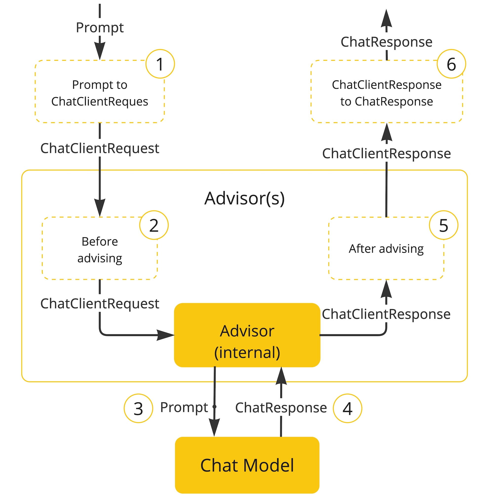

# Advisors API
Advisors API는 LLM 요청을 가로채서 인터셉트, 데이터 가공 등의 기능들을 제공하기 때문에 더 정교하고 재사용성과 유지보수성 높은 AI 컴포넌트 제작이 가능하도록 도와줌
> https://docs.spring.io/spring-ai/reference/1.1-SNAPSHOT/api/advisors.html

# 핵심 컴포넌트

## CallAdvisor / CallAdvisorChain
비동기 아닌(non-streaming) 시나리오에서 사용됨.

## StreamAdvisor / StreamAdvisorChain
Streaming 시나리오에서 사용됨

## ChatClientRequest / ChatClientResponse
- ChatClientRequest: LLM 호출 전에 구성된 프롬프트 데이터를 나타냄.
- ChatClientResponse: LLM 응답을 나타냄.
> 이들은 advisor chain 내에서 상태를 공유하기 위해 context 포함.

## 주요 메서드
### nextCall() / nextStream()
프롬프트 데이터를 검사하거나 커스터마이징하거나 수정한 뒤 다음 advisor 호출 또는 LLM 호출
> 예외 발생 가능 (처리 실패 시)

### getOrder()
체인 내 실행 순서를 결정.
> 값이 작을수록 먼저 실행됨.

### getName()
어드바이저 고유 이름 반환.

## 어드바이저 체인 동작 특징
- Spring AI가 자동으로 Advisor Chain을 구성함.
- 여러 advisor들이 getOrder() 값 기준으로 순차적으로 실행됨.
- 마지막에는 LLM 호출이 자동으로 붙음.

## Advisor chain -> Chat Model 흐름

1. Spring AI는 사용자의 Prompt를 기반으로 `ChatClientRequest`와 비어 있는 `context`를 생성함.
2. Advisor 체인의 각 advisor는 request를 처리하며, 필요 시 내용을 수정할 수 있음.
   > advisor는 다음 advisor를 호출하지 않고 요청을 차단할 수도 있음. 이 경우 advisor가 응답을 직접 작성해야 함.
3. 마지막 advisor(프레임워크가 제공)는 실제 Chat Model에 요청을 보냄.
4. Chat Model의 응답은 `ChatClientResponse`로 변환되고, `context`와 함께 advisor 체인을 거슬러 올라가며 전달됨.
5. 각 advisor는 응답을 가공하거나 처리할 수 있음.
6. 최종적으로 클라이언트는 `ChatClientResponse`에서 `ChatCompletion`을 추출해 받게 됨.

## Advisor 실행 순서
getOrder() 메서드로 advisor 실행 순서를 결정함.
<br/>숫자가 작을수록 먼저 실행됨.

### 체인 동작 방식
- 요청 처리 시: 순서가 낮은 advisor부터 순차 실행됨.
- 응답 처리 시: 요청의 역순으로 처리됨  
   >먼저 실행된 advisor가 가장 나중에 응답을 처리함 (스택처럼 작동).

### 실행 순서 제어 팁
- 가장 먼저 요청을 처리하고 싶다면 `Ordered.HIGHEST_PRECEDENCE`에 가깝게 설정.
- 가장 마지막에 요청을 처리하고 싶다면 `Ordered.LOWEST_PRECEDENCE`에 가깝게 설정.
> 같은 order 값을 가지는 여러 advisor는 실행 순서가 보장되지 않음.


# API Overview
Advisor를 구성하는 핵심 인터페이스 구조
> `org.springframework.ai.chat.client.advisor.api`에 위치
## Advisor
핵심 인터페이스로서 Ordered를 상속받은 구조
```java
public interface Advisor extends Ordered {

	String getName();

}
```

## CallAdvisor
동기적인 Advisor
```java
public interface CallAdvisor extends Advisor {

    ChatClientResponse adviseCall(
            ChatClientRequest chatClientRequest, CallAdvisorChain callAdvisorChain);

}
```
## CallAdvisorChain
Advisor의 chain을 지속하기 위한 인터페이스
```java
public interface CallAdvisorChain extends AdvisorChain {

    /**
     * Invokes the next {@link CallAdvisor} in the {@link CallAdvisorChain} with the given
     * request.
     */
    ChatClientResponse nextCall(ChatClientRequest chatClientRequest);

    /**
     * Returns the list of all the {@link CallAdvisor} instances included in this chain at
     * the time of its creation.
     */
    List<CallAdvisor> getCallAdvisors();

}
```

## StreamAdvisor
Streaming advisor
```java
public interface StreamAdvisor extends Advisor {

    Flux<ChatClientResponse> adviseStream(
            ChatClientRequest chatClientRequest, StreamAdvisorChain streamAdvisorChain);

}
```
## StreamAdvisorChain
Advisor의 chain을 지속하기 위한 인터페이스
```java
public interface StreamAdvisorChain extends AdvisorChain {

    /**
     * Invokes the next {@link StreamAdvisor} in the {@link StreamAdvisorChain} with the
     * given request.
     */
    Flux<ChatClientResponse> nextStream(ChatClientRequest chatClientRequest);

    /**
     * Returns the list of all the {@link StreamAdvisor} instances included in this chain
     * at the time of its creation.
     */
    List<StreamAdvisor> getStreamAdvisors();

}
```

# Advisor 구현하기
Advisor를 생성하기 위해서는 `CallAdvisor`또는 `StreamAdvisor`를 구현해야됨
> 핵심 구현 메서드는 `nextCall()`또는 `nextStream()`

## Logging Advisor (샘플)
`chatClientRequest` 전에 로그를 생성하고, 다음 advisor 호출 후 `chatClientResponse` 로그를 생성하는 advisor 샘플
```java
public class SimpleLoggerAdvisor implements CallAdvisor, StreamAdvisor {

    private static final Logger logger = LoggerFactory.getLogger(SimpleLoggerAdvisor.class);

    @Override
    public String getName() {
        /** advisor의 고유 이름 정의 */
        return this.getClass().getSimpleName();
    }

    @Override
    public int getOrder() {
        /** advisor 실행 순서 설정 */
        return 0;
    }

    @Override
    public ChatClientResponse adviseCall(ChatClientRequest chatClientRequest, CallAdvisorChain callAdvisorChain) {
        logger.info("BEFORE: {}", chatClientRequest);
        ChatClientResponse chatClientResponse = callAdvisorChain.nextCall(chatClientRequest);
        logger.info("AFTER: {}", chatClientResponse);
        return chatClientResponse;
    }

    @Override
    public Flux<ChatClientResponse> adviseStream(ChatClientRequest chatClientRequest, StreamAdvisorChain streamAdvisorChain) {
        logger.info("BEFORE: {}", chatClientRequest);
        Flux<ChatClientResponse> chatClientResponseFlux = streamAdvisorChain.nextStream(chatClientRequest);
        /** ChatClientMessageAggregator Flux 응답을 하나의 AdvisedResponse로 모아주는 유틸리티 클래스. */
        return new ChatClientMessageAggregator().aggregateChatClientResponse(chatClientResponseFlux,
                advisedResponse -> logger.debug("AFTER: {}", advisedResponse));
    }
}
```

## Re-Reading (Re2) Advisor (샘플)
> Re-Reading : 동일한 질문을 한 번 더 프롬프트에 삽입함으로써 모델의 주의 집중과 문제 이해를 향상시키는 방식

```java
public class ReReadingAdvisor implements BaseAdvisor {

    private static final String DEFAULT_RE2_ADVISE_TEMPLATE = """
            {re2_input_query}
            Read the question again: {re2_input_query}
            """;

    private final String re2AdviseTemplate;

    private int order = 0;

    public ReReadingAdvisor() {
        this(DEFAULT_RE2_ADVISE_TEMPLATE);
    }

    public ReReadingAdvisor(String re2AdviseTemplate) {
        this.re2AdviseTemplate = re2AdviseTemplate;
    }
    /** 사용자의 input query에 Re2를 적용하는 메서드 */
    @Override
    public ChatClientRequest before(ChatClientRequest chatClientRequest, AdvisorChain advisorChain) {
        String augmentedUserText = PromptTemplate.builder()
                .template(this.re2AdviseTemplate)
                .variables(Map.of("re2_input_query", chatClientRequest.prompt().getUserMessage().getText()))
                .build()
                .render();

        return chatClientRequest.mutate()
                .prompt(chatClientRequest.prompt().augmentUserMessage(augmentedUserText))
                .build();
    }

    @Override
    public ChatClientResponse after(ChatClientResponse chatClientResponse, AdvisorChain advisorChain) {
        return chatClientResponse;
    }

    @Override
    public int getOrder() {
        return this.order;
    }

    public ReReadingAdvisor withOrder(int order) {
        this.order = order;
        return this;
    }

}
```

# Built in Advisor
Spring AI에 내장된 Advisor

## Chat Memory Advisors
Chat Memory Store에서 대화 기록을 관리하는 Advisor

### MessageChatMemoryAdvisor
메모리를 검색하여 Prompt에 메시지 컬렉션 형태로 추가하여 대화 흐름의 구조를 유지

### PromptChatMemoryAdvisor
메모리를 검색하여 프롬프트의 system 메시지(system text)안에 통합

### VectorStoreChatMemoryAdvisor
Vector store의 메모리를 검색하여 system 메시지(system text)에 추가
> 거대한 데이터 속에서 관련있는 데이터를 효율적으로 검색하기에 용이함

## Question Answering Advisor
질의응답 관련 Advisor
### QuestionAnswerAdvisor
RAG패턴을 구현하여, 벡터 스토어를 활용한 질의응답 기능을 제공

### RetrievalAugmentationAdvisor
org.springframework.ai.rag 패키지에 정의된 구성 요소(예: retriever, reranker, prompt builder 등)를 조합하여 모듈형(Modular) RAG 아키텍처에 따라 작동

## Reasoning Advisor
추론 관련 Advisor
### ReReadingAdvisor
Re-Reading을 구현하는 Advisor

## Content Safety Advisor
### SafeGuardAdvisor
모델이 유해하거나 부적절한 응답 생성을 방지

# Streaming vs Non-Streaming

- Non streaming advisor는 완료된 요청과 응답에서 동작
- Streaming advisor는 지속되는 요청과 응답을 다룸
   > Reactive Programing 컨셉 사용
```java
@Override
public Flux<ChatClientResponse> adviseStream(ChatClientRequest chatClientRequest, StreamAdvisorChain chain) {

    return  Mono.just(chatClientRequest)
            .publishOn(Schedulers.boundedElastic())
            .map(request -> {
                // This can be executed by blocking and non-blocking Threads.
                // Advisor before next section
            })
            .flatMapMany(request -> chain.nextStream(request))
            .map(response -> {
                // Advisor after next section
            });
}
```

# Best Practice
- 역할 분리: 각 advisor는 하나의 명확한 기능만 수행하도록 구성.
- 상태 공유: 필요한 경우 `adviseContext`를 통해 advisor 간 정보를 공유.
- 유연한 대응: 스트리밍과 일반 응답 방식 둘 다 구현하여 다양한 상황에 대응.
- 순서 고려: advisor 실행 순서를 신중하게 설정하여 데이터 흐름이 자연스럽도록 하라.

# Spring AI 1.0.0 변경 사항

| **이전 이름**                  | **변경된 이름**           |
|----------------------------|----------------------|
| `CallAroundAdvisor`        | `CallAdvisor`        |
| `StreamAroundAdvisor`      | `StreamAdvisor`      |
| `CallAroundAdvisorChain`   | `CallAdvisorChain`   |
| `StreamAroundAdvisorChain` | `StreamAdvisorChain` |
| `AdvisedRequest`           | `ChatClientRequest`  |
| `AdvisedResponse`          | `ChatClientResponse` |
