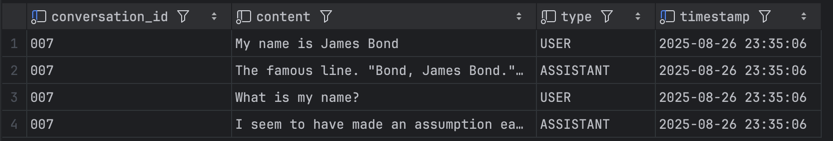

# Chat Memory (JdbcChatMemoryRepository)
JDBC를 사용하는 ChatMemory 사용 예시

# 의존성 추가
```groovy
    implementation 'org.springframework.ai:spring-ai-starter-model-chat-memory-repository-jdbc'
```

# Properties 추가
```properties
# DB 스키마 초기화 유형 (always 시 항상 초기화 하며, table이 생성됨)
# spring.ai.chat.memory.repository.jdbc.initialize-schema=always

spring.datasource.url=jdbc:mariadb://localhost:3306/chatdb
spring.datasource.driver-class-name=org.mariadb.jdbc.Driver
spring.datasource.username=username
spring.datasource.password=password
```

# 사용 샘플
```java

@Autowired
JdbcChatMemoryRepository chatMemoryRepository;
@Autowired
ChatModel chatModel;

public void sample(){
    // First interaction
    String conversationId = "007";
    UserMessage userMessage1 = new UserMessage("My name is James Bond");
    chatMemory.add(conversationId, userMessage1);
    ChatResponse response1 = chatModel.call(new Prompt(chatMemory.get(conversationId)));
    chatMemory.add(conversationId, response1.getResult().getOutput());

    // Second interaction
    UserMessage userMessage2 = new UserMessage("What is my name?");
    chatMemory.add(conversationId, userMessage2);
    ChatResponse response2 = chatModel.call(new Prompt(chatMemory.get(conversationId)));
    chatMemory.add(conversationId, response2.getResult().getOutput());
}


```

# 적재 결과
