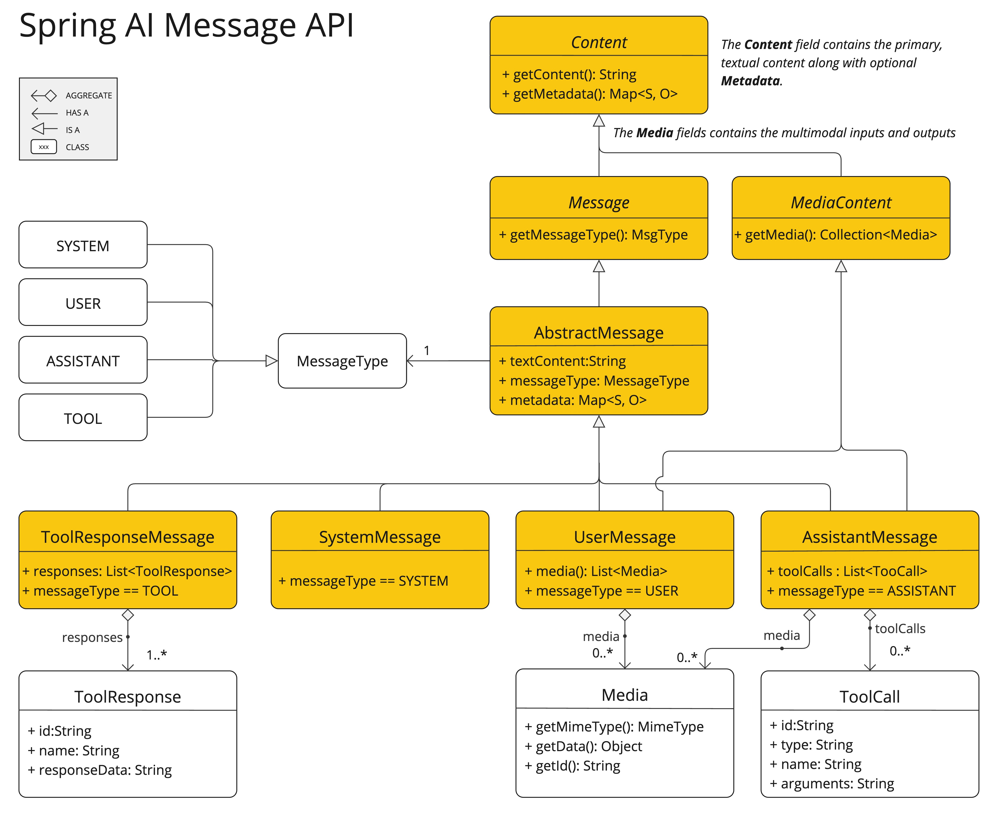

# Multimodality API
이미지, 텍스트 등을 처리하기 위한 API
> https://docs.spring.io/spring-ai/reference/1.1-SNAPSHOT/api/multimodality.html

# 배경
인간은 텍스트, 이미지, 오디오, 비디오 등 다양한 입력을 동시에 이해하지만 과거의 AI 모델은 단일 모달(텍스트만, 오디오만 등)에 특화되어 있었음. 반면 최근에는 OpenAI GPT-4o, Claude 3, Gemini 1.5, LLaVA 등처럼 여러 모달을 동시에 처리하는 대형 모델들이 등장하였음

# Spring AI Multimodality
Multimodality는 모델의 다양한 소스(이미지, 텍스트 등)들을 동시에 처리하는 능력과 관련이 있다.
The Spring AI의 `Message API`는 멀티모 LLM들을 지원하기 위한 추상화를 지원한다.

## UserMessage
- content: 텍스트 입력
- media: 이미지/오디오/비디오 등의 추가 입력

## Media
- MIME 타입(MimeTypeUtils.IMAGE_PNG 등) + 실제 미디어 데이터(Resource나 URI) 포함

## AssistantMessage
- 응답은 텍스트만 포함


# 샘플
아래 사진의 설명을 요청하는 예시
> llava 모델 사용

```java
String response = ChatClient.create(chatModel).prompt()
        .user(u -> u.text("Explain what do you see on this picture?")
                .media(MimeTypeUtils.IMAGE_PNG, new ClassPathResource("/multimodal.test.png")))
        .call()
        .content();
/*
 * The image shows a metal wire basket containing three bananas and two red apples. 
 * The bananas are yellow with visible dark spots, indicating they might be ripe. 
 * The apples appear to be fresh and have a bright red color. 
 * In the background, there is what looks like a part of a room or interior decor, possibly a wall with a blue hue, but not enough detail is visible to provide more information about the setting. 
 */

```