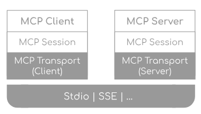

# Model Context Protocol (MCP)
Model Context Protocol은 구조화된 방법으로 AI가 외부 tool또는 자원과 상호작용하도록 하는 프로토콜이며 서로 다른 환경에서 유연한 연동을 제공하기 위하여 다양한 전송 방법을 지원한다. 
> https://docs.spring.io/spring-ai/reference/1.1-SNAPSHOT/api/mcp/mcp-overview.html

# MCP Java SDK
MCCP Java SDK는 Tool과 AI Model의 표준적인 상호작용을 가능하도록 하는 MCP의 Java 구현체이다. 
> 동기/비동기 패턴 둘 다 지원

# Spring AI MCP
Spring AI MCP는 Spring Boot integration과 함께 MCP Java SDK의 확장이고, client와 server 스타터 둘 다 제공한다.

# MCP Java SDK Architecture
Java MCP 구현은 아래 3계층의 구조를 가진다.

- client/server layer: `McpServer`가 서버측 프로토콜을 운영하는동안 `McpClient`가 클라이언트 측을 운영한다.
- Session layer: 커뮤니케이션 패턴과 상태를 `McpClientSession`와 `McpClientSession` 구현체로 관리
- Transport layer: 다양한 전송 구현체와 함께 JSON-RPC 메시지의 직렬화/역직렬화를 관리한다.

# MCP Client
MCP Client는 MCP Server들과 함께 연결의 수립과 관리의 역할을 수행하는 MCP구성의 핵심 컴포넌트이다.

## 주 역할
- 프로토콜 버전 협상
- 이용 가능한 기능 결정
- JSON-RPC 커뮤니케이션 메시지 전송
- Tool 탐색과 실행
- 리소스 접근과 관리
- 프롬프트 시스템 상호작용
- 선택기능(루트 관리, 샘플릿 지원)
- 동기/비동기 동작
- 전송 옵션(Stdio기반, HttpClient기반 SSE, WebFlux기반 SSE)

# MCP Server
MCP Server는 tool, 자원, client 수용 능력을 제공하는 MCP의 근본이되는 컴포넌트이다.

## 주 역할
- 서버측 프로토콜 동작 구현
  - Tool 제공 및 탐색 지원
  - 리소스 관리(URI 기반)
  - 프롬프트 템플릿 제공 및 처리
  - Client 수용 협상
  - 구조화된 로깅과 알림
- 현재 클라이언트 연결 관리
- 동기/비동기 API 지원
- 전송 관련 구현(Stdio기반, Streamable-HTTP, Stateless Streamable-HTTP, SSE)

# Spring AI MCP Integration
Spring AI는 Spring boot Starter를 통해 MCP 통합을 제공한다.
## Client Starter
- `spring-ai-starter-mcp-client`: STDIO를 제공하는 핵심 스타터로서, 서블릿 기반 Streamable-HTTP, Stateless Streamable-HTTP, SSE를 지원한다.
- `spring-ai-starter-mcp-client-webflux`: Webflux기반 Streamable-HTTP, Stateless Streamable-HTTP, SSE 전송 구현

## Server Starter
### STDIO
- spring-ai-starter-mcp-server

### WebMVC
- SSE : spring-ai-starter-mcp-server-webmvc
- WebMVC: spring-ai-starter-mcp-server-webmvc
- Stateless WebMVC: spring-ai-starter-mcp-server-webmvc

### WebMVC (Reactive)
- SSE Webflux: spring-ai-starter-mcp-server-webflux
- Streamable-HTTP Webflux: spring-ai-starter-mcp-server-webflux
- Stateless Webflux: spring-ai-starter-mcp-server-webflux

# MCP Annotation
Spring AI는 어노테이션 기반 프로그래밍 모델을 제공하여, 서버/클라이언트 MCP 기능을 선언적으로 정의할 수 있다.

## 장점
- 도구, 리소스, 프롬프트를 어노테이션으로 간단히 생성
- 클라이언트 알림/요청을 선언적으로 처리
- 보일러플레이트 코드 감소, 유지보수 용이
- Tool 파라미터에 대한 자동 JSON Schema 생성
- 특수 파라미터 및 컨텍스트 접근 지원

## 주요 기능
- 서버 어노테이션: @McpTool, @McpResource, @McpPrompt, @McpComplete
- 클라이언트 어노테이션: @McpLogging, @McpSampling, @McpElicitation, @McpProgress
- 특수 파라미터: McpSyncServerExchange, McpAsyncServerExchange, McpTransportContext, McpMeta
- 자동 탐지: 패키지 스캔으로 MCP 어노테이션 자동 등록
- Spring Boot 통합: MCP Boot Starter와 원활히 연동
