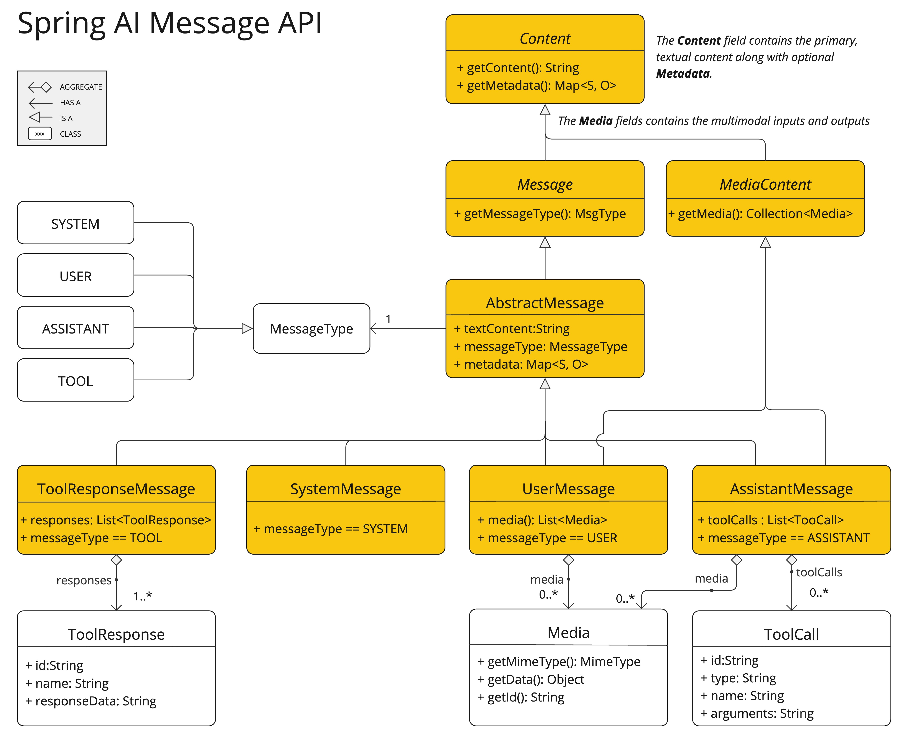

# Prompts
Prompt는 AI 모델에 지시를 내리는 입력이며, 설계 방식이 결과에 큰 영향을 미치며 마치 SQL 문 + MVC의 View 템플릿 개념처럼 동작함
> https://docs.spring.io/spring-ai/reference/1.1-SNAPSHOT/api/prompt.html

# API 개요
## Prompt
### 역할
ChatModel.call(Prompt)에 전달되어 ChatResponse를 반환하는 대화 요청 객체

### 구성
- List<Message>: 다양한 역할(user, assistant, system 등)의 메시지들을 순차적으로 저장
- ChatOptions: 모델 설정 (예: 온도, 토큰 제한 등)

## Message
Message는 텍스트 콘텐츠, 메타데이터, 그리고 역할 타입 (MessageType) 을 포함하는 핵심 인터페이스
```java
public interface Content {
	String getContent();
	Map<String, Object> getMetadata();
}

public interface Message extends Content {
	MessageType getMessageType();
}
```
### 멀티 모달 메시지
멀티모달 메시지는 MediaContent를 구현하여 이미지, 오디오 등 미디어 컨텐츠 리스트를 포함
```java
public interface MediaContent extends Content {
	Collection<Media> getMedia();
}
```

### Message 구현체
Spring AI는 다양한 메시지 타입을 제공하며, AI 모델이 각각의 역할(Role)에 따라 적절히 동작하도록 지원


### 주요 역할
> MessageType과 매핑됨
- System : AI의 행동 방식을 설정. 초기 프롬프트 지침 역할
- User : 사용자의 질문/명령/요청. 대화의 시작점
- Assistant : AI의 응답. 이전 문맥을 기억하여 일관된 대화 유지. 필요 시 함수 호출(Function Tool Call) 포함.
- Tool : Assistant의 Tool Call 요청에 대한 결과 응답. e.g. 계산, 데이터 조회 등.

## PromptTemplate
AI 모델에 전달할 구조화된 프롬프트를 생성하기 위한 주요 템플릿 도구
```java
public class PromptTemplate implements PromptTemplateActions, PromptTemplateMessageActions {

    // Other methods to be discussed later
}
```

### TemplateRenderer
PromptTemplate클래스가 템플릿을 랜더링 하기 위해 사용하는 interface로서 기본 구현체는 StTemplateRenderer이고 기본 구분자는 `{}`이다.
```java
public interface TemplateRenderer extends BiFunction<String, Map<String, Object>, String> {

	@Override
	String apply(String template, Map<String, Object> variables);

}
```
### 사용 예시
```java
PromptTemplate promptTemplate = PromptTemplate.builder()
    .renderer(StTemplateRenderer.builder().startDelimiterToken('<').endDelimiterToken('>').build())
    .template("""
            Tell me the names of 5 movies whose soundtrack was composed by <composer>.
            """)
    .build();

String prompt = promptTemplate.render(Map.of("composer", "John Williams"));
```

### 관련 인터페이스
- PromptTemplateStringActions : 프롬프트 문자열 렌더링 관련
    ```java
    public interface PromptTemplateStringActions {
    
        String render();
    
        String render(Map<String, Object> model);
    
    }
    ```
- PromptTemplateMessageActions : Message 객체 기반의 프롬프트 생성
    ```java
    public interface PromptTemplateMessageActions {
    
        Message createMessage();
    
        Message createMessage(List<Media> mediaList);
    
        Message createMessage(Map<String, Object> model);
    
    }
    ```
- PromptTemplateActions : Prompt 객체 자체 생성
    ```java
    public interface PromptTemplateActions extends PromptTemplateStringActions {
    
        Prompt create();
    
        Prompt create(ChatOptions modelOptions);
    
        Prompt create(Map<String, Object> model);
    
        Prompt create(Map<String, Object> model, ChatOptions modelOptions);
    
    }
    ```


# 사용 예시
## PromptTemplate 예시
```java
PromptTemplate promptTemplate = new PromptTemplate("Tell me a {adjective} joke about {topic}");

Prompt prompt = promptTemplate.create(Map.of("adjective", adjective, "topic", topic));

return chatModel.call(prompt).getResult();
```

## SystemPromptTemplate 예시
```java
String userText = """
    Tell me about three famous pirates from the Golden Age of Piracy and why they did.
    Write at least a sentence for each pirate.
    """;

Message userMessage = new UserMessage(userText);

String systemText = """
  You are a helpful AI assistant that helps people find information.
  Your name is {name}
  You should reply to the user's request with your name and also in the style of a {voice}.
  """;

SystemPromptTemplate systemPromptTemplate = new SystemPromptTemplate(systemText);
Message systemMessage = systemPromptTemplate.createMessage(Map.of("name", name, "voice", voice));

Prompt prompt = new Prompt(List.of(userMessage, systemMessage));

List<Generation> response = chatModel.call(prompt).getResults();
```

# Prompt Engineering
> 관련 가이드 : https://www.promptingguide.ai/
## 효과적인 프롬프트 생성 요소
효과적인 프롬프트를 만들기 위한 요소들
### Instructions (지시)
명확하고 구체적인 작업 지시 제공. AI가 “무엇을 해야 할지” 분명히 인식하게 만들음

### External Context (외부 맥락)
AI가 상황을 이해할 수 있도록 배경 정보나 추가 지침 제공.

### User Input (사용자 질문)
프롬프트의 중심. 사용자의 직접적인 질문이나 요청.

### Output Indicator (출력 포맷 지정)
응답 형식을 명시 (예: JSON). 단, AI가 형식을 완전히 준수하지 않을 수도 있음.

### Examples (예시 제공)
기대하는 질문-응답 패턴을 예시로 보여주면 AI가 구조와 목적을 명확히 이해하는 데 도움됨.

## 기법
### 간단한 기법
- Text Summarization: 긴 문서에서 핵심 정보 요약
- Question Answering: 질문에 대한 정확한 정보 추출
- Text Classification: 텍스트를 사전 정의된 카테고리로 분류
- Conversation: 자연스러운 대화 시뮬레이션
- Code Generation: 설명에 따라 실행 가능한 코드 생성

### 고급 기법
- Zero-shot / Few-shot Learning
   - 예시 없이도 AI가 새로운 문제에 대응할 수 있도록 일반화 능력을 유도

- Chain-of-Thought (CoT)
   - 복잡한 문제 해결 시, 사고 과정을 단계별로 유도
   - 일관된 대화 흐름 유지에 효과적

- ReAct (Reason + Act)
   - AI가 먼저 입력을 분석(Reason)하고, 그 후 행동(Action)을 선택
   - 분석적 사고와 실천적 대응의 결합

### 마이크로소프트 지도
- Framework for Prompt Creation and Optimization
   - 체계적 설계와 튜닝을 위한 프레임워크 제공
   - 효율적이고 명확한 프롬프트 구성을 지원함으로써 일관된 성능 확보

# Tokens
단어를 AI가 이해할 수 있는 형식으로 바꾸는 단위. 입력 시 단어 → 토큰, 출력 시 토큰 → 단어로 변환됨.

## Tokenization
텍스트를 잘게 나누는 과정. 일반적으로 단어의 약 3/4이 하나의 토큰.
> e.g. 셰익스피어 전집 90만 단어 -> 약 120만 토큰.
> https://platform.openai.com/tokenizer 링크에서 텍스트<->토큰 변환 확인 가능

## Token 영향
### 요금 부과
입력과 출력 토큰 수 기준으로 과금됨. 짧을수록 저렴.

### 모델 제한
각 모델마다 처리 가능한 최대 토큰 수(context window)가 다름.
> e.g. GPT-3 → 4K, Claude 2 & LLaMA 2 → 100K, 연구용 모델은 최대 1M.

### Context Window
이 범위를 넘는 토큰은 무시됨. 불필요한 정보는 줄이는 것이 핵심.

### 추적 및 관리
응답 metadata에 토큰 수 포함되어 있어 사용량과 비용 관리에 유용.


