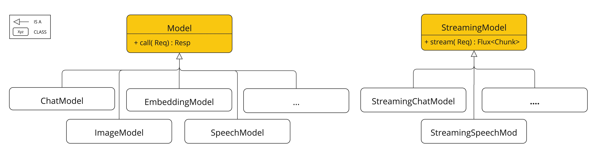
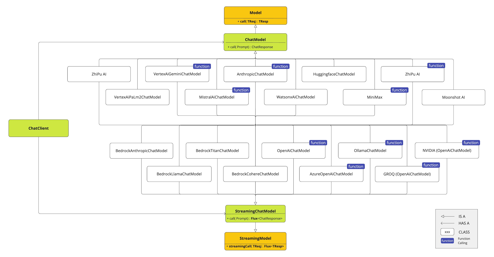
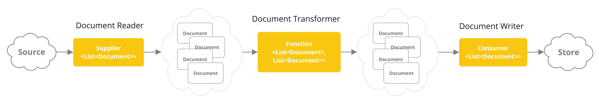

# Spring AI API
Spring AI의 핵심 API 설명
> https://docs.spring.io/spring-ai/reference/1.1-SNAPSHOT/api/index.html

# AI Model API
다양한 제공자의 지원 모델들을 공통화된 인터페이스로 제공하며 동기식, 비동기식을 모두 지원함
- 지원 모델 : Chat, Text to Image, Audio Transcription, Text to Speech, Embedding
- 제공자 : OpenAI, MS, AWS, Google 등

## 동기/비동기 모델 계층

### ChatModel

# Vector store API
`SQL-like metadata filter API`를 제공하고 14개 이상의 벡터 데이터베이스 지원 
> `SQL-like metadata filter API` : 데이터를 필터링할 수 있는 기능을 SQL 문법처럼 사용할 수 있게 한 API

# Tool Calling API
`@Tool`어노테이션을 통하여 AI 모델이 서비스 로직 메서드나 Function 객체를 호출하도록 쉽게 구성할 수 있음

# Auto Configuration
Spring boot에서 AI Model 또는 Vector Store들의 Autoconfiguration 또는 스타터 제공

# ETL Data Engineering
벡터 DB에 데이터를 적재하는 ETL 프레임워크를 제공하고 RAG(Retrieval Augmented Generation) 구현을 지원

# Feedback and Contributions
[GitHub Discussions](https://github.com/spring-projects/spring-ai/discussions)를 통해 피드백 및 기여 가능

