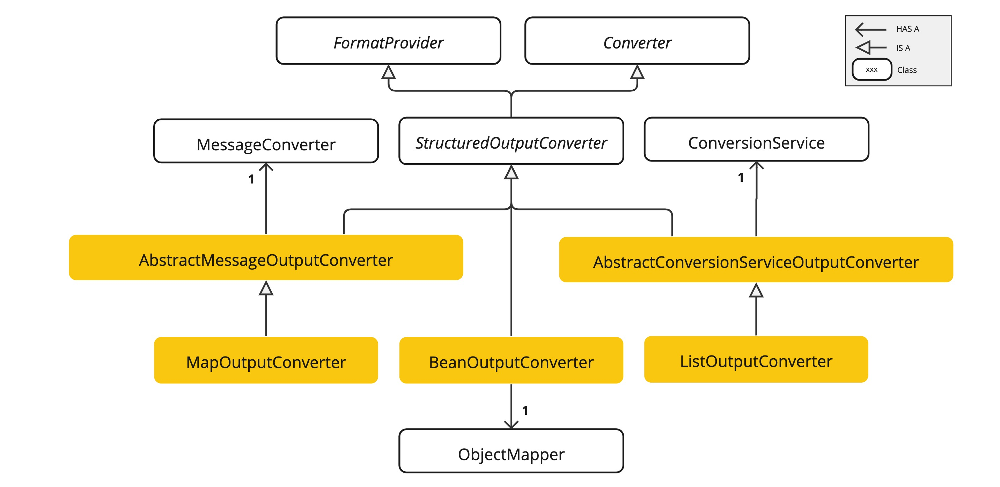

# Structured Output Converter
LLM의 output을 원하는 포맷으로 변환하기 위해 사용됨
> https://docs.spring.io/spring-ai/reference/1.1-SNAPSHOT/api/structured-output-converter.html


- LLM 입력 전: 출력 형식에 대한 명확한 지시(format instructions)를 프롬프트에 삽입.
- LLM 출력 후: 결과 텍스트를 원하는 Java 타입으로 자동 변환.

# Structured Output API
StructuredOutputConverter 인터페이스는 원하는 구조의 output을 얻을 수 있도록 한다.
> Spring의 `Converter`와 `FormatProvider` 인터페이스롸 결합된다.
```java
public interface StructuredOutputConverter<T> extends Converter<String, T>, FormatProvider {

}
```
## Structured Output API 사용 시 데이터 흐름
- getFormat() : 모델에 보낼 출력 포맷 안내문 제공
- convert(String) : 모델 출력 텍스트를 T 타입으로 변환


# Converter


- AbstractConversionServiceOutputConverter<T> : GenericConversionService 활용한 일반 컨버터.
- AbstractMessageOutputConverter<T> : MessageConverter 기반 컨버터
- BeanOutputConverter : JSON -> Java 객체 (지정된 클래스 기반). JSON Schema 사용 가능.
- MapOutputConverter : JSON -> Map<String, Object>. RFC8259 준수 JSON 요구.
- ListOutputConverter : 콤마로 구분된 문자열 -> List 변환.

# Converter 사용법
## BeanOutputConverter
### ChatClient 사용 시
```java
ActorsFilms actorsFilms = ChatClient.create(chatModel).prompt()
        .user(u -> u.text("Generate the filmography of 5 movies for {actor}.")
                    .param("actor", "Tom Hanks"))
        .call()
        //변환할 타입 전달
        .entity(ActorsFilms.class);
```
### ChatModel 사용 시
```java
BeanOutputConverter<ActorsFilms> beanOutputConverter =
    new BeanOutputConverter<>(ActorsFilms.class);

String format = this.beanOutputConverter.getFormat();

String actor = "Tom Hanks";

String template = """
        Generate the filmography of 5 movies for {actor}.
        {format}
        """;

Generation generation = chatModel.call(
    PromptTemplate.builder().template(this.template).variables(Map.of("actor", this.actor, "format", this.format)).build().create()).getResult();

ActorsFilms actorsFilms = this.beanOutputConverter.convert(this.generation.getOutput().getText());
```

### ParameterizedTypeReference활용
제네릭 타입으로 변환이 필요한 경우 ParameterizedTypeReference 활용
```java
List<ActorsFilms> actorsFilms = ChatClient.create(chatModel).prompt()
        .user("Generate the filmography of 5 movies for Tom Hanks and Bill Murray.")
        .call()
        .entity(new ParameterizedTypeReference<List<ActorsFilms>>() {});
```

## MapOutputConverter
```java
Map<String, Object> result = ChatClient.create(chatModel).prompt()
        .user(u -> u.text("Provide me a List of {subject}")
                    .param("subject", "an array of numbers from 1 to 9 under they key name 'numbers'"))
        .call()
        .entity(new ParameterizedTypeReference<Map<String, Object>>() {});
```

## ListOutputConverter
```java
List<String> flavors = ChatClient.create(chatModel).prompt()
                .user(u -> u.text("List five {subject}")
                            .param("subject", "ice cream flavors"))
                .call()
                .entity(new ListOutputConverter(new DefaultConversionService()));
```