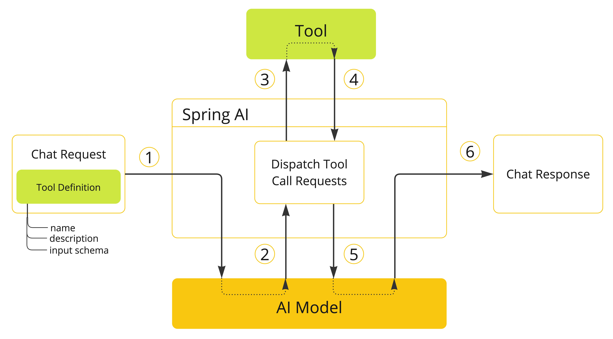

# Tool Calling 
Tool Calling(Function Calling)은 Model이 Api, Tool 등과 상호작용할 수 있는 패턴이다.
> https://docs.spring.io/spring-ai/reference/1.1-SNAPSHOT/api/tools.html

# 주 용도
- 정보 탐색 : Web service, DB, File system, 검색엔진 등 외부 정보를 탐색
- 액션 수행 : Email전송, DB 적재, 양식 제출, 워크플로우 동작 등을 수행

# Quick Start
애플리케이션의 현재시간을 가져오는것(정보 탐색)과 특정 시간에 알람을 수행하는 것(액션 수행)을 구현
## 정보 탐색 샘플
`@Tool`어노테이션을 메서드 위에 선언해야하고, AI 모델이 이해하고 적절한 시점에 호출할 수 있도록 상세한 설명을 추가한다.
### 현재 시간 조회 툴 선언
현재 시간을 가져오는 Tool
```java
import java.time.LocalDateTime;
import org.springframework.ai.tool.annotation.Tool;
import org.springframework.context.i18n.LocaleContextHolder;

class DateTimeTools {

    @Tool(description = "Get the current date and time in the user's timezone")
    String getCurrentDateTime() {
        return LocalDateTime.now().atZone(LocaleContextHolder.getTimeZone().toZoneId()).toString();
    }

}
```
### 사용
```java
ChatModel chatModel = ...

String response = ChatClient.create(chatModel)
        .prompt("What day is tomorrow?")
        .tools(new DateTimeTools())
        .call()
        .content();

// Tomorrow is 2015-10-21.
System.out.println(response);
```

## 액션 수행
사용자가 입력한 시간에 알람을 수행하는 Tool
### 알람 실행 툴 선언
```java
import java.time.LocalDateTime;
import java.time.format.DateTimeFormatter;
import org.springframework.ai.tool.annotation.Tool;
import org.springframework.context.i18n.LocaleContextHolder;

class DateTimeTools {
    @Tool(description = "Set a user alarm for the given time, provided in ISO-8601 format")
    void setAlarm(String time) {
        LocalDateTime alarmTime = LocalDateTime.parse(time, DateTimeFormatter.ISO_DATE_TIME);
        System.out.println("Alarm set for " + alarmTime);
    }
}
```
### 사용
Prompt가 전달되면 이전에 선언한 툴(`getCurrentDateTime`)로 현재시간을 구하고 `setAlarm`툴을 호출 시 사용하여 동작할 수 있음
```java
ChatModel chatModel = ...

String response = ChatClient.create(chatModel)
        .prompt("Can you set an alarm 10 minutes from now?")
        .tools(new DateTimeTools())
        .call()
        .content();

System.out.println(response);
```

# 개요
## Tool calling 주요 컨셉

1. 모델이 이용할 수 있는 Tool을 만들때 `Chat Request`내부에 name, description, input schema 구성으로 정의
2. 모델이 Tool을 사용하고자 할 때 해당 Tool의 이름과 파라미터들을 전달
3. 애플리케이션은 Tool 이름으로 Tool을 식별하고 파라미터를 제공
4. Tool 호출 결과값을 애플리케이션에 의해 처리
5. 애플리케이션은 Tool 호출 결과값을 모델에 반환
6. 모델은 Tool 호출 응답값과 추가적인 문장으로 응답

# Tool 선언 방식
Tool 선언 방식은 `선언적`이거나 `동적`으로 선언할 수 있다.

## 선언적(@Tool)
```java
class DateTimeTools {

    @Tool(description = "Get the current date and time in the user's timezone")
    String getCurrentDateTime() {
        return LocalDateTime.now().atZone(LocaleContextHolder.getTimeZone().toZoneId()).toString();
    }

}
```
### 핵심 정보
- name : AI 모델이 식별하기 위해 사용됨 (유일해야함)
- description : 모델이 언제/어떻게 실행할 지 이애할 수 있도록 제공되는 설명 (최대한 상세히 작성하는 것을 권장)
- returnDirect : 툴 호출 시 반환 방식 (true => 그대로 전달, false => 문맥에 맞춰 모델이 가공 후 전달)
- resultConverter : 반환된 원본 결과를 모델에 전달할 때 변환 방식 정의

### @ToolParam
Spring AI는 @Tool어노테이션이 명시된 메서드의 입력 파라미터를 위해 JSON Schema를 생성한다.
@ToolParam 어노테이션은 파라미터에 추가적인 설명을 제공한다.
- description : 어떤 포맷으로 입력할지와 같은 상세 설명
- required : 파라미터 필수 입력 여부 (기본값: true)
```java
import java.time.LocalDateTime;
import java.time.format.DateTimeFormatter;
import org.springframework.ai.tool.annotation.Tool;
import org.springframework.ai.tool.annotation.ToolParam;

class DateTimeTools {

    @Tool(description = "Set a user alarm for the given time")
    void setAlarm(@ToolParam(description = "Time in ISO-8601 format") String time) {
        LocalDateTime alarmTime = LocalDateTime.parse(time, DateTimeFormatter.ISO_DATE_TIME);
        System.out.println("Alarm set for " + alarmTime);
    }

}
```

### Chat Client에 Tool 추가하기
선언적 방식으로 Tool을 Chat Client에 추가하기 위해서 tools()메서드에 Tool을 추가한다.
```java
ChatClient.create(chatModel)
    .prompt("What day is tomorrow?")
    .tools(new DateTimeTools())
    .call()
    .content();
```

### @Tool 메서드 별로 나누기
ToolCallbacks.from() 메서드를 통해 선언된 메서드 별로 `ToolCallback` 인스턴스를 만들 수 있다.
```java
ToolCallback[] dateTimeTools = ToolCallbacks.from(new DateTimeTools());
```

### Default tool 정의
ChatClient.builder의 defaultTools()메서드로 기본 tool을 정의할 수 있다.
```java
ChatModel chatModel = ...
ChatClient chatClient = ChatClient.builder(chatModel)
    .defaultTools(new DateTimeTools())
    .build();
```

### ChatModel에 Tool 추가하기
```java
ChatModel chatModel = ...
ToolCallback[] dateTimeTools = ToolCallbacks.from(new DateTimeTools());
ChatOptions chatOptions = ToolCallingChatOptions.builder()
    .toolCallbacks(dateTimeTools)
    .build();
Prompt prompt = new Prompt("What day is tomorrow?", chatOptions);
chatModel.call(prompt);
```

### ChatModel에 Default Tool 추가하기
```java
ToolCallback[] dateTimeTools = ToolCallbacks.from(new DateTimeTools());
ChatModel chatModel = OllamaChatModel.builder()
    .ollamaApi(OllamaApi.builder().build())
    .defaultOptions(ToolCallingChatOptions.builder()
            .toolCallbacks(dateTimeTools)
            .build())
    .build();
```

## 동적 선언
### MethodToolCallback.Builder 주요 정보
Tool 메서드를 실행 가능한 콜백으로 등록
- toolDefinition : 도구 이름, 설명, 입력 스키마 정의
- toolMetadata : 결과 반환 방식(returnDirect)과 결과 변환기(resultConverter) 설정
- toolMethod : Tool 메서드
- toolObject : 메서드가 속한 객체 인스턴스
- toolCallResultConverter : 호출 결과를 모델에 전달할 문자열로 변환하는 로직

### ToolDefinition.Builder 주요 정보
Tool 이름/설명/입력 스키마를 정의
- name : Tool 이름 (고유해야함)
- description : Tool 설명
- inputSchema : Tool 입력 파라미터의 JSON Schema (제공하지 않으면 자동 생성)


### ToolMetadata.Builder 주요 정보
- returnDirect: Tool 결과 반환 방식 true => 그대로 전달, false => 문맥에 맞춰 모델이 가공 후 전달)

#### 샘플
```java
Method method = ReflectionUtils.findMethod(DateTimeTools.class, "getCurrentDateTime");
ToolCallback toolCallback = MethodToolCallback.builder()
    .toolDefinition(ToolDefinitions.builder(method)
            .description("Get the current date and time in the user's timezone")
            .build())
    .toolMethod(method)
    .toolObject(new DateTimeTools())
    .build();
```

#### static으로 선언 시
static으로 선언하면 toolObject()메서드에 선언을 생략할 수 있음
```java
class DateTimeTools {

    static String getCurrentDateTime() {
        return LocalDateTime.now().atZone(LocaleContextHolder.getTimeZone().toZoneId()).toString();
    }

}

Method method = ReflectionUtils.findMethod(DateTimeTools.class, "getCurrentDateTime");
ToolCallback toolCallback = MethodToolCallback.builder()
        .toolDefinition(ToolDefinitions.builder(method)
                .description("Get the current date and time in the user's timezone")
                .build())
        .toolMethod(method)
//        .toolObject(new DateTimeTools())
        .build();
```

### ChatClient에 Tool 선언
```java
ToolCallback toolCallback = ...
ChatClient.create(chatModel)
    .prompt("What day is tomorrow?")
    .toolCallbacks(toolCallback)
    .call()
    .content();
```

### ChatClient에 Default Tool 선언
```java
ChatModel chatModel = ...
ToolCallback toolCallback = ...
ChatClient chatClient = ChatClient.builder(chatModel)
    .defaultToolCallbacks(toolCallback)
    .build();
```

### ChatModel에 Tool 선언
```java
ChatModel chatModel = ...
ToolCallback toolCallback = ...
ChatOptions chatOptions = ToolCallingChatOptions.builder()
    .toolCallbacks(toolCallback)
    .build():
Prompt prompt = new Prompt("What day is tomorrow?", chatOptions);
chatModel.call(prompt);
```

### ChatModel에 Default Tool 선언
```java
ToolCallback toolCallback = ...
ChatModel chatModel = OllamaChatModel.builder()
    .ollamaApi(OllamaApi.builder().build())
    .defaultOptions(ToolCallingChatOptions.builder()
            .toolCallbacks(toolCallback)
            .build())
    .build();
```

## 메서드 Tool 제약사항
현재 Type또는 반환으로 제약되는 사항은 아래와 같다.
- Optional
- Asynchronous types (e.g. CompletableFuture, Future)
- Reactive types (e.g. Flow, Mono, Flux)
- Functional types (e.g. Function, Supplier, Consumer).


# Functions as tools
Function object(Function, Supplier, Consumer, BiFunction)를 활용한 Tool 선언 방법
```java
public class WeatherService implements Function<WeatherRequest, WeatherResponse> {
    public WeatherResponse apply(WeatherRequest request) {
        return new WeatherResponse(30.0, Unit.C);
    }
}

public enum Unit { C, F }
public record WeatherRequest(String location, Unit unit) {}
public record WeatherResponse(double temp, Unit unit) {}
```
## Programmatic 명시 (FunctionToolCallback)
FunctionToolCallback.Builder은 `FunctionToolCallback`인스턴스를 생성하며 아래 주요 정보들을 설정할 수 있다.

- name : Tool 이름 (고유해야함)
- toolFunction: tool method를 나타낼 function object(Function, Supplier, Consumer, BiFunction)
- description : Tool 설명
- inputType: function input type
- inputSchema : Tool 입력 파라미터의 JSON Schema (제공하지 않으면 자동 생성)
- toolDefinition : 도구 이름, 설명, 입력 스키마 정의
- toolMetadata : 결과 반환 방식 설정 (ToolMetadata.Builder 활용 가능)
- toolCallResultConverter : 호출 결과를 모델에 전달할 문자열로 변환 (기본적으로 `DefaultToolCallResultConverter` 사용)
- returnDirect : 툴 호출 시 반환 방식 (true => 그대로 전달, false => 문맥에 맞춰 모델이 가공 후 전달)
```java
ToolCallback toolCallback = FunctionToolCallback
.builder("currentWeather", new WeatherService())
.description("Get the weather in location")
.inputType(WeatherRequest.class)
.build();
```

### ChatClient에 Tool 추가
```java
ToolCallback toolCallback = ...
ChatClient.create(chatModel)
    .prompt("What's the weather like in Copenhagen?")
    .toolCallbacks(toolCallback)
    .call()
    .content();
```

### ChatClient에 Default Tool 추가
```java
ChatModel chatModel = ...
ToolCallback toolCallback = ...
ChatClient chatClient = ChatClient.builder(chatModel)
    .defaultToolCallbacks(toolCallback)
    .build();
```

### ChatModel에 tool 추가
```java
ChatModel chatModel = ...
ToolCallback toolCallback = ...
ChatOptions chatOptions = ToolCallingChatOptions.builder()
    .toolCallbacks(toolCallback)
    .build():
Prompt prompt = new Prompt("What's the weather like in Copenhagen?", chatOptions);
chatModel.call(prompt);
```

### ChatModel에 default tool 추가
```java
ToolCallback toolCallback = ...
ChatModel chatModel = OllamaChatModel.builder()
        .ollamaApi(OllamaApi.builder().build())
        .defaultOptions(ToolCallingChatOptions.builder()
                .toolCallbacks(toolCallback)
                .build())
        .build();
```

## 동적 명시 (@Bean)
Spring bean으로 정의한 뒤 `ToolCallbackResolver`를 통해서 Tool을 정의할 수 있다.
```java
@Configuration(proxyBeanMethods = false)
class WeatherTools {

    WeatherService weatherService = new WeatherService();

	@Bean
	@Description("Get the weather in location")
	Function<WeatherRequest, WeatherResponse> currentWeather() {
		return weatherService;
	}

}
```
### @ToolParam
Function 인자값에 @ToolParam를 선언할 수 있음
```java
record WeatherRequest(@ToolParam(description = "The name of a city or a country") String location, Unit unit) {}
```

### Bean 이름 명시
tool로 선언된 bean의 이름이 tool의 이름이 되기 때문에 명확히 하지 않으면 런타임 에러가 발생할 수 있음
> Bean의 이름을 상수로 사용하여 단점을 완화할 수 있음
```java
@Configuration(proxyBeanMethods = false)
class WeatherTools {

    public static final String CURRENT_WEATHER_TOOL = "currentWeather";

	@Bean(CURRENT_WEATHER_TOOL)
	@Description("Get the weather in location")
	Function<WeatherRequest, WeatherResponse> currentWeather() {
		...
	}

}
```

### ChatClient에 tool 추가
```java
ChatClient.create(chatModel)
    .prompt("What's the weather like in Copenhagen?")
    //런타임 에러를 완화하기 위해서는 tool name을 상수로 선언
    .toolNames(WeatherTools.CURRENT_WEATHER_TOOL)
    //.toolNames("currentWeather")
    .call()
    .content();
```

### ChatClient에 default tool 추가
```java
ChatModel chatModel = ...
ChatClient chatClient = ChatClient.builder(chatModel)
    .defaultToolNames("currentWeather")
    .build();
```

### ChatModel에 tool 추가
```java
ChatModel chatModel = ...
ChatOptions chatOptions = ToolCallingChatOptions.builder()
    .toolNames("currentWeather")
    .build();
Prompt prompt = new Prompt("What's the weather like in Copenhagen?", chatOptions);
chatModel.call(prompt);
```

### ChatModel에 default tool 추가
```java
ChatModel chatModel = OllamaChatModel.builder()
    .ollamaApi(OllamaApi.builder().build())
    .defaultOptions(ToolCallingChatOptions.builder()
            .toolNames("currentWeather")
            .build())
    .build();
```

## Function Tool 제약사항
아래는 현재 지원되지 않는 function type이다.
- Primitive types
- Optional
- Collection types (e.g. List, Map, Array, Set)
- Asynchronous types (e.g. CompletableFuture, Future)
- Reactive types (e.g. Flow, Mono, Flux).

