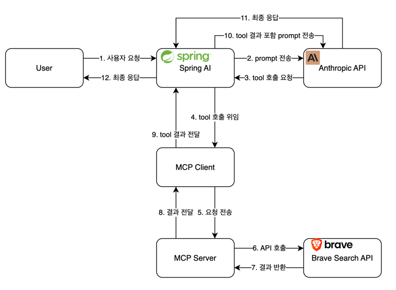

# Brave Web Search Chatbot(MCP Client 예제)
MCP를 통해 Web search를 사용하는 Chat bot 예제
> https://github.com/spring-projects/spring-ai-examples/tree/main/model-context-protocol/web-search/brave-chatbot

## 예제 개요
Brave Web 검색과 엔트로픽의 클로드 AI를 사용하여 사용자의 물음에 웹 검색을 통한 응답을 수행하는 Chatbot 애플리케이션 예제


## 사전 준비
- JDK 17이상
- Maven 3.6이상
- npx
- 엔트로픽 API Key
- Brave API Key

## 셋업
### npx 설치
```shell
npm install -g npx
```

### 저장소 복제
```shell
git clone https://github.com/spring-projects/spring-ai-examples.git
cd spring-ai-examples/model-context-protocol/web-search/brave-chatbot
```

### Key 설정
```shell
export ANTHROPIC_API_KEY='your-anthropic-api-key-here'
export BRAVE_API_KEY='your-brave-api-key-here'
```

### 애플리케이션 빌드
```shell
./mvnw clean install
```

## 실행
Maven을 통해 실행하는 법
```shell
./mvnw spring-boot:run
```

## 동작 방식
해당 앱이 동작하는 방식
### MCP Client 구성
#### 필요 의존성 추가 (pom.xml)
```xml
<dependency>
    <groupId>org.springframework.ai</groupId>
    <artifactId>spring-ai-starter-mcp-client</artifactId>
</dependency>
<dependency>
    <groupId>org.springframework.ai</groupId>
    <artifactId>spring-ai-starter-model-anthropic</artifactId>
</dependency>
```

#### 애플리케이션 설정
````yaml
spring:
  ai:
    mcp:
      client:
        enabled: true
        name: brave-search-client
        version: 1.0.0
        type: SYNC  # or ASYNC for reactive applications
        request-timeout: 20s
        stdio:
          root-change-notification: true
          servers-configuration: classpath:/mcp-servers-config.json
    anthropic:
      api-key: ${ANTHROPIC_API_KEY}
````

#### MCP 서버 설정
````json
{
  "mcpServers": {
    "brave-search": {
      "command": "npx",
      "args": [
        "-y",
        "@modelcontextprotocol/server-brave-search"
      ],
      "env": {
        "BRAVE_API_KEY": "${BRAVE_API_KEY}"
      }
    }
  }
}
````

## 클라이언트 유형
- 동기 : 블럭킹 방식으로 전통적인 요청-응답 패턴에 적합 (기본)
- 비동기 : 논블럭킹 방식으로 리액티브 애플리케이에 적합
> `spring.ai.mcp.client.type`에서 변경 가능 (SYNC, ASYNC)

## Chatbot 구현
Chatbot은 MCP와 Spring AI로 구현됨
```java
var chatClient = chatClientBuilder
    .defaultSystem("You are a useful assistant, expert in AI and Java.")
    .defaultToolCallbacks((Object[]) mcpToolAdapter.toolCallbacks())
    .defaultAdvisors(new MessageChatMemoryAdvisor(new InMemoryChatMemory()))
    .build();
```
### 핵심 기능
- 자연어 처리를 위한 클로드 AI 사용
- 실시간 웹 검색을 위해 MCP를 통한 Brave Web search 사용
- InMemoryChatMemory를 통한 대화 저장 (대화 연속성)
- command line을 통해 애플리케이션과 상호작용

### Chatbot이 할 수 있는 것
- 내장 지식을 활용한 응답
- 필요 시 Brave 웹 검색 사용
- 이전 대화 기억
- 포괄적인 응답 제공을 위하여 다양한 정보 결합

## 추가 설정
MCP Client는 추가적인 설정을 지원
- `McpSyncClientCustomizer`또는 `McpAsyncClientCustomizer`를 통해 커스텀
- 다중 전송 지원 (STDIO, SSE (Server-Sent Events))
- Spring AI의 툴 실행과 연동
- 클라이언트 자동 초기화 및 생명주기 관리

### Web Flux 기반 의존성
Web flux기반으로 사용할 경우 아래의 의존성으로 추가
```xml
<dependency>
    <groupId>org.springframework.ai</groupId>
    <artifactId>spring-ai-starter-mcp-client-webflux</artifactId>
</dependency>
```

## 동작 흐름



