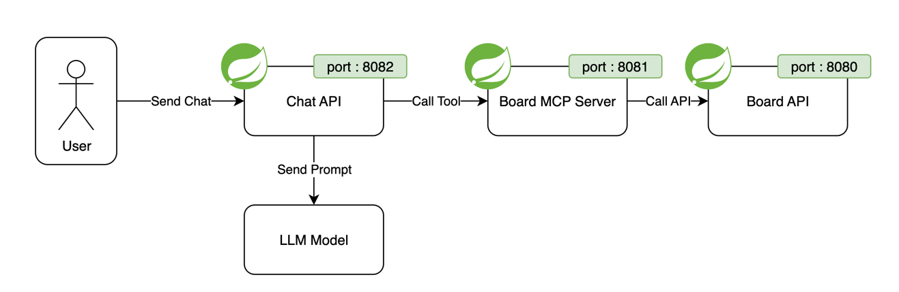
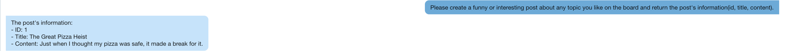
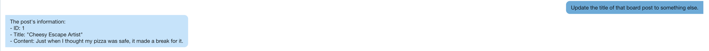
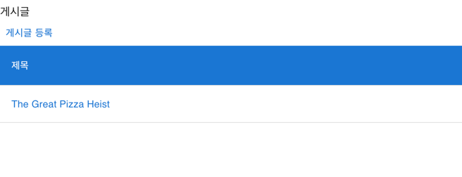
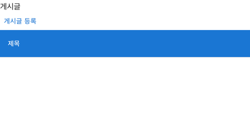

# AI Board
Spring ai를 활용하여 AI가 Board API를 통해 게시글을 등록할 수 있도록 구성된 샘플 프로젝트

## 핵심 기술
해당 프로젝트를 구성하기 위해 사용된 핵심 기술
- Spring AI : LLM Model을 애플리케이션에 간편하게 적용하기 위해 사용되는 라이브러리
- MCP : Board API 서버를 LLM Model이 사용할 수 있도록 하기 위해 사용되는 프로토콜

## 구성

- Chat API: Model을 호출하여 채팅 API를 제공하는 서비스
- Board MCP Server: 게시판(조회/생성/수정/삭제)기능을 도구로 제공하기 위한 MCP 서버
- Board API: 게시판 API를 제공하는 서비스

## Tools 사용 결과
### 게시글 생성 Tool
```text
Q. Please create a funny or interesting post about any topic you like on the board and return the post's information(id, title, content).

A. The post's information:
- ID: 1
- Title: The Great Pizza Heist
- Content: Just when I thought my pizza was safe, it made a break for it.
```
#### 채팅 결과


#### 게시글 생성 결과


### 게시글 수정 Tool
```text
Q. Update the title of that board post to something else.

A. The post's information:
- ID: 1
- Title: "Cheesy Escape Artist"
- Content: Just when I thought my pizza was safe, it made a break for it.
```

#### 채팅 결과


#### 게시글 수정 결과


### 게시글 상세 조회 Tool
```text
Q. Show me the content of that post

A. The content of the board post is:

Just when I thought my pizza was safe, it made a break for it.
```

### 게시글 삭제 Tool
```text
Q. Now delete the post that you just showed.

A. The board post with ID 1 has been deleted.
```

#### 게시글 삭제 전

#### 게시글 삭제 후


### 게시글 조회 Tool
```text
Q. Please list all the current posts to confirm that the previous one has been deleted.

A. The board is currently empty. There are no remaining posts.
```