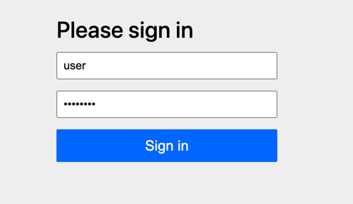
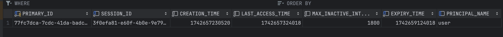

# 개요
spring security의 session 기반 인증에서 session에 영속화를 부여
> 참고 링크 : https://docs.spring.io/spring-session/reference/configuration/jdbc.html

# 설정
## 의존성
```groovy
dependencies {
    ... 
    implementation 'org.springframework.boot:spring-boot-starter-security'
    implementation 'org.springframework.boot:spring-boot-starter-data-jpa'
    implementation 'org.springframework.boot:spring-boot-starter-web'
    implementation 'org.springframework.session:spring-session-jdbc'
    implementation 'org.springframework.boot:spring-boot-starter-jdbc'
    implementation 'org.mariadb.jdbc:mariadb-java-client'
    ...
}
```

## 환경설정
```properties
spring.datasource.url=jdbc:mariadb://localhost:3306/database
spring.datasource.username=root
spring.datasource.password=password
spring.datasource.driver-class-name=org.mariadb.jdbc.Driver

# Spring Session을 JDBC 기반으로 설정 (MariaDB 사용)
spring.session.store-type=jdbc
spring.session.jdbc.table-name=SPRING_SESSION
# 세션 유지 시간 설정 (예: 30분)
server.servlet.session.timeout=30m
```

## session table 생성
session을 저장하기 위해 SPRING_SESSION, SPRING_SESSION_ATTRIBUTES 테이블을 추가
```sql
CREATE TABLE SPRING_SESSION (
                                PRIMARY_ID CHAR(36) NOT NULL,
                                SESSION_ID CHAR(36) NOT NULL,
                                CREATION_TIME BIGINT NOT NULL,
                                LAST_ACCESS_TIME BIGINT NOT NULL,
                                MAX_INACTIVE_INTERVAL INT NOT NULL,
                                EXPIRY_TIME BIGINT NOT NULL,
                                PRINCIPAL_NAME VARCHAR(100),
                                CONSTRAINT SPRING_SESSION_PK PRIMARY KEY (PRIMARY_ID)
);

CREATE UNIQUE INDEX SPRING_SESSION_IX1 ON SPRING_SESSION (SESSION_ID);
CREATE INDEX SPRING_SESSION_IX2 ON SPRING_SESSION (EXPIRY_TIME);
CREATE INDEX SPRING_SESSION_IX3 ON SPRING_SESSION (PRINCIPAL_NAME);

CREATE TABLE SPRING_SESSION_ATTRIBUTES (
                                           SESSION_PRIMARY_ID CHAR(36) NOT NULL,
                                           ATTRIBUTE_NAME VARCHAR(200) NOT NULL,
                                           ATTRIBUTE_BYTES BLOB NOT NULL,
                                           CONSTRAINT SPRING_SESSION_ATTRIBUTES_PK PRIMARY KEY (SESSION_PRIMARY_ID, ATTRIBUTE_NAME),
                                           CONSTRAINT SPRING_SESSION_ATTRIBUTES_FK FOREIGN KEY (SESSION_PRIMARY_ID) REFERENCES SPRING_SESSION(PRIMARY_ID) ON DELETE CASCADE
);
```

## configuration 추가
```java
@Configuration
@EnableJdbcHttpSession
public class SessionConfig {
    //...
}

```

# 실행
## 로그인
> 계정정보 : user / password



## 로그인 성공
#### 로그인 성공 후 리다이렉트 페이지


#### 영속화된 session


## spring app restart 후 웹 페이지 접근
#### 재시작 후에도 로그인 세션이 유지된 화면

